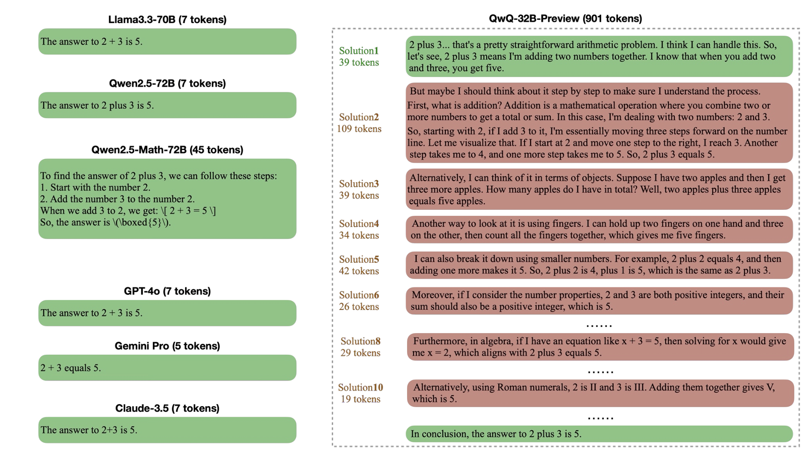

# Awesome-Chain-Compression

A curated list for **Chain Compression**

### Updates

- 2025-03-16: Initial version

### Full list

| Title & Authors | Introduction | Links |
|:--|  :----: | :---:|
| [CoT-Valve: Length-Compressible Chain-of-Thought Tuning](https://arxiv.org/abs/2502.09601)   Xinyin Ma, Guangnian Wan, Runpeng Yu, Gongfan Fang, Xinchao Wang | |[Github](https://github.com/horseee/CoT-Valve)   [Paper](https://arxiv.org/abs/2502.09601)|[//]: #03/16
| [O1-Pruner: Length-Harmonizing Fine-Tuning for O1-Like Reasoning Pruning](https://arxiv.org/abs/2501.12570)   Haotian Luo, Li Shen, Haiying He, Yibo Wang, Shiwei Liu, Wei Li, Naiqiang Tan, Xiaochun Cao, Dacheng Tao | |[Github](https://github.com/StarDewXXX/O1-Pruner)   [Paper](https://arxiv.org/abs/2501.12570)|[//]: #03/16
|[Do NOT Think That Much for 2+3=? On the Overthinking of o1-Like LLMs](https://arxiv.org/abs/2412.21187)   Xingyu Chen, Jiahao Xu, Tian Liang, Zhiwei He, Jianhui Pang, Dian Yu, Linfeng Song, Qiuzhi Liu, Mengfei Zhou, Zhuosheng Zhang, Rui Wang, Zhaopeng Tu, Haitao Mi, Dong Yu | |[Paper](https://arxiv.org/abs/2412.21187)|[//]: #03/16
| [C3oT: Generating Shorter Chain-of-Thought without Compromising Effectiveness](https://arxiv.org/abs/2412.11664)   Yu Kang, Xianghui Sun, Liangyu Chen, Wei Zou | |[Paper](https://arxiv.org/abs/2412.11664)|[//]: #03/16
| [Can Language Models Learn to Skip Steps?](https://arxiv.org/abs/2411.01855)   Tengxiao Liu, Qipeng Guo, Xiangkun Hu, Cheng Jiayang, Yue Zhang, Xipeng Qiu, Zheng Zhang | |[Github](https://github.com/tengxiaoliu/LM_skip)   [Paper](https://arxiv.org/abs/2411.01855)|[//]: #03/16
|[Distilling System 2 into System 1](https://arxiv.org/abs/2407.06023)   Ping Yu, Jing Xu, Jason Weston, Ilia Kulikov | |[Paper](https://arxiv.org/abs/2407.06023)|[//]: #03/16

#### Technical Reports

* [Kimi k1.5: Scaling Reinforcement Learning with LLMs](https://arxiv.org/abs/2501.12599). Kimi Team. [[Paper]](https://arxiv.org/abs/2501.12599)

### Contribution

If you want to add your paper or update details like conference info or code URLs, please submit a pull request. You can generate the necessary markdown for each paper by filling out `generate_item.py` and running `python generate_item.py`. We greatly appreciate your contributions. Alternatively, you can email me the links to your paper and code, and I will add your paper to the list as soon as possible.

### Acknowledgement

This repository is inspired by [Awesome-Efficient-LLM](https://github.com/horseee/Awesome-Efficient-LLM/)