<div align="center">

  <h2><b> Efficient Reasoning Models: A Survey </b></h2>
  <h4> An overview of research in efficient reasoning models</h4>

</div>


<div align="center">


<a href="https://arxiv.org/abs/2504.10903" target="_blank"></a>

</div>

<div align="center">

**[<a href="https://arxiv.org/abs/2504.10903">arXiv</a>]** **[<a href="https://huggingface.co/papers/2504.10903">HuggingFace</a>]** **[<a href="https://x.com/si_feng32704/status/1912378179718901843">X</a>]**

</div>


This repository is for our paper:

> **[Efficient Reasoning Models: A Survey](https://arxiv.org/abs/2504.10903)** \
> [Sicheng Feng](https://fscdc.github.io/)<sup>1,2</sup>, [Gongfan Fang](https://fangggf.github.io/)<sup>1</sup>, [Xinyin Ma](https://horseee.github.io/)<sup>1</sup>, [Xinchao Wang](https://sites.google.com/site/sitexinchaowang/)<sup>1,*</sup> \
> <sup>1</sup>National University of Singapore, Singapore \
> <sup>2</sup>Nankai University, Tianjin, China \
> <sup>∗</sup>Corresponding author: xinchao@nus.edu.sg

---
>
> 🙋 Please let us know if you find out a mistake or have any suggestions!
> 
> 🌟 If you find this resource helpful, please consider to star this repository and cite our [research](#citation)!

<p align="center">

</p>


## Updates


- 2025-05-18: 🎉 We open a new section about efficient [multimodal reasoning methods](#efficient-multimodal-reasoning)!
- 2025-05-16: 🎉 Two-month milestone! Special thanks to [VainF](https://github.com/VainF), [horseee](https://github.com/horseee), [CHEN1594](https://github.com/CHEN1594), [ZhenyuSun-Walker](https://github.com/ZhenyuSun-Walker), [xianzuwu](https://github.com/xianzuwu)!
- 2025-04-16: 📝 The survey is now available on [arXiv](https://arxiv.org/abs/2504.10903)!
- 2025-04-11: 📚 The full paper list is now available, and our survey is coming soon!
- 2025-03-16: 🚀 Efficient Reasoning Repo launched!


## Full list


> **Contributions**
>
> If you want to add your paper or update details like conference info or code URLs, please submit a pull request. You can generate the necessary markdown for each paper by filling out `generate_item.py` and running `python generate_item.py`. We greatly appreciate your contributions. Alternatively, you can email me ([Gmail](fscnkucs@gmail.com)) the links to your paper and code, and I will add your paper to the list as soon as possible.

---
<p align="center">

</p>

### Quick Links
  - [Make Long CoT Short](#Make-Long-CoT-Short)
    - [SFT-based Methods](#SFT-based-Methods)
    - [RL-based Methods](#RL-based-Methods)
    - [Prompt-driven Methods](#Prompt-driven-Methods)
    - [Latent Reasoning](#Latent-Reasoning)
  - [Build SLM with Strong Reasoning Ability](#Build-SLM-with-Strong-Reasoning-Ability)
    - [Distillation](#Distillation)
    - [Quantization and Pruning](#Quantization-and-Pruning)
    - [RL+SLM Methods](#rlslm-methods)
  - [Let Decoding More Efficient](#Let-Decoding-More-Efficient)
    - [Efficient TTS](#Efficient-TTS)
    - [Other Optimal Methods](#Other-Optimal-Methods)
  - [Efficient Multimodal Reasoning](#Efficient-Multimodal-Reasoning)
  - [Evaluation and Benchmarks](#Evaluation-and-Benchmarks)
  - [Background Papers](#Background-Papers)
  - [Competition](#Competition)


### Make Long CoT Short

#### SFT-based Methods
| Title & Authors | Introduction | Links |
|:--|  :----: | :---:|
|[](https://github.com/ZGCA-AI4Edu/LS-Mixture)<br>[Long-Short Chain-of-Thought Mixture Supervised Fine-Tuning Eliciting Efficient Reasoning in Large Language Models](https://arxiv.org/abs/2505.03469) <br> Bin Yu, Hang Yuan, Yuliang Wei, Bailing Wang, Weizhen Qi, Kai Chen | |[Github](https://github.com/ZGCA-AI4Edu/LS-Mixture) <br> [Paper](https://arxiv.org/abs/2505.03469)| [//]: #05/17
|[](https://github.com/horseee/CoT-Valve)<br>[CoT-Valve: Length-Compressible Chain-of-Thought Tuning](https://arxiv.org/abs/2502.09601) <br> Xinyin Ma, Guangnian Wan, Runpeng Yu, Gongfan Fang, Xinchao Wang |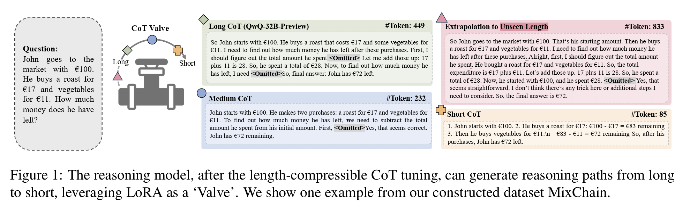 |[Github](https://github.com/horseee/CoT-Valve) <br> [Paper](https://arxiv.org/abs/2502.09601)|[//]: #03/16
|[Llama-Nemotron: Efficient Reasoning Models](https://arxiv.org/abs/2505.00949) <br> NVIDIA | |[Paper](https://arxiv.org/abs/2505.00949)| [//]: #05/05
|[]()<br>[C3oT: Generating Shorter Chain-of-Thought without Compromising Effectiveness](https://arxiv.org/abs/2412.11664) <br> Yu Kang, Xianghui Sun, Liangyu Chen, Wei Zou |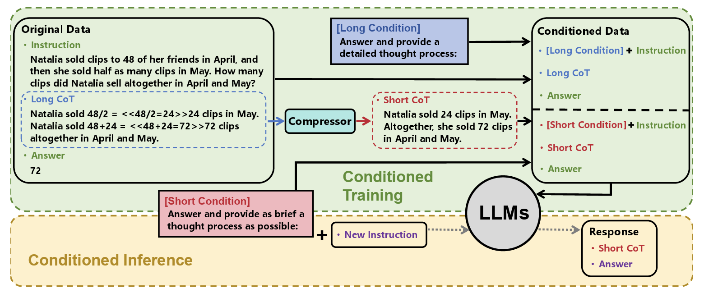 |[Paper](https://arxiv.org/abs/2412.11664)|[//]: #03/16
|[](https://github.com/tengxiaoliu/LM_skip) []()<br>[Can Language Models Learn to Skip Steps?](https://arxiv.org/abs/2411.01855) <br> Tengxiao Liu, Qipeng Guo, Xiangkun Hu, Cheng Jiayang, Yue Zhang, Xipeng Qiu, Zheng Zhang |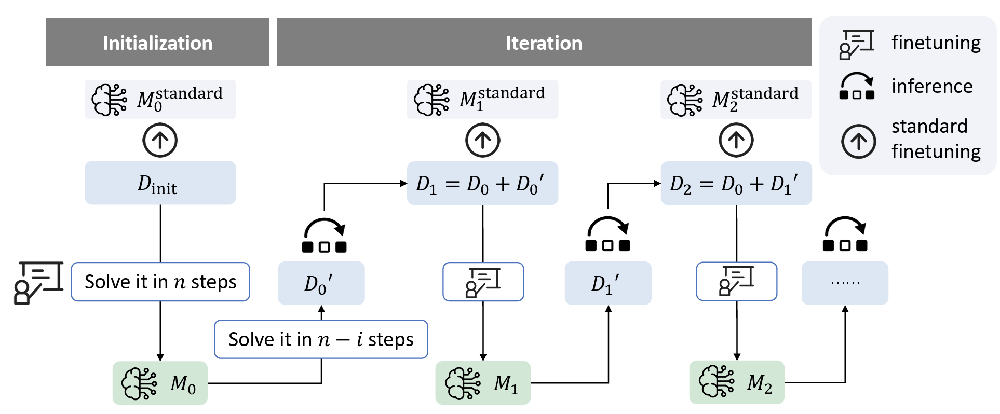 |[Github](https://github.com/tengxiaoliu/LM_skip) <br> [Paper](https://arxiv.org/abs/2411.01855)|[//]: #03/16
|[Distilling System 2 into System 1](https://arxiv.org/abs/2407.06023) <br> Ping Yu, Jing Xu, Jason Weston, Ilia Kulikov |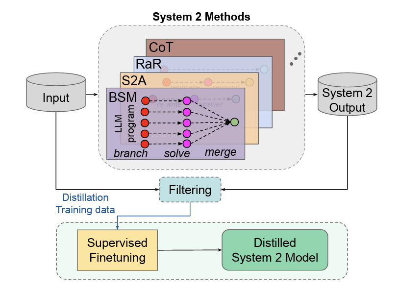 |[Paper](https://arxiv.org/abs/2407.06023)|[//]: #03/16
|[](https://github.com/hemingkx/TokenSkip)<br>[TokenSkip: Controllable Chain-of-Thought Compression in LLMs](https://arxiv.org/abs/2502.12067) <br> Heming Xia, Yongqi Li, Chak Tou Leong, Wenjie Wang, Wenjie Li |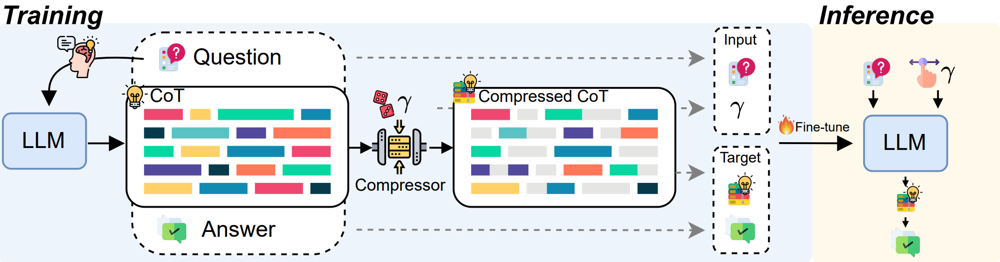 |[Github](https://github.com/hemingkx/TokenSkip) <br> [Paper](https://arxiv.org/abs/2502.12067)|[//]: #03/20
|[Stepwise Perplexity-Guided Refinement for Efficient Chain-of-Thought Reasoning in Large Language Models](https://arxiv.org/abs/2502.13260) <br> Yingqian Cui, Pengfei He, Jingying Zeng, Hui Liu, Xianfeng Tang, Zhenwei Dai, Yan Han, Chen Luo, Jing Huang, Zhen Li, Suhang Wang, Yue Xing, Jiliang Tang, Qi He | |[Paper](https://arxiv.org/abs/2502.13260)| [//]: #04/08
|[Towards Thinking-Optimal Scaling of Test-Time Compute for LLM Reasoning](https://arxiv.org/abs/2502.18080) <br> Wenkai Yang, Shuming Ma, Yankai Lin, Furu Wei | |[Paper](https://arxiv.org/abs/2502.18080)| [//]: #04/08
|[](https://github.com/TergelMunkhbat/concise-reasoning)<br>[Self-Training Elicits Concise Reasoning in Large Language Models](https://arxiv.org/abs/2502.20122) <br> Tergel Munkhbat, Namgyu Ho, Seo Hyun Kim, Yongjin Yang, Yujin Kim, Se-Young Yun | |[Github](https://github.com/TergelMunkhbat/concise-reasoning) <br> [Paper](https://arxiv.org/abs/2502.20122)| [//]: #04/08
|[](https://github.com/GeniusHTX/TALE)<br>[Token-Budget-Aware LLM Reasoning](https://arxiv.org/abs/2412.18547) <br> Tingxu Han, Zhenting Wang, Chunrong Fang, Shiyu Zhao, Shiqing Ma, Zhenyu Chen | |[Github](https://github.com/GeniusHTX/TALE) <br> [Paper](https://arxiv.org/abs/2412.18547)| [//]: #04/08


#### RL-based Methods
| Title & Authors | Introduction | Links |
|:--|  :----: | :---:|
|[Learning to Think: Information-Theoretic Reinforcement Fine-Tuning for LLMs](https://arxiv.org/abs/2505.10425) <br> Jingyao Wang, Wenwen Qiang, Zeen Song, Changwen Zheng, Hui Xiong | |[Paper](https://arxiv.org/abs/2505.10425)| [//]: #05/18
|[MilChat: Introducing Chain of Thought Reasoning and GRPO to a Multimodal Small Language Model for Remote Sensing](https://arxiv.org/abs/2505.07984) <br> Aybora Koksal, A. Aydin Alatan | |[Paper](https://arxiv.org/abs/2505.07984)| [//]: #05/17
|[Scalable Chain of Thoughts via Elastic Reasoning](https://arxiv.org/abs/2505.05315) <br> Yuhui Xu, Hanze Dong, Lei Wang, Doyen Sahoo, Junnan Li, Caiming Xiong | |[Paper](https://arxiv.org/abs/2505.05315)| [//]: #05/17
|[](https://github.com/CodeGoat24/UnifiedReward)<br>[Unified Multimodal Chain-of-Thought Reward Model through Reinforcement Fine-Tuning](https://arxiv.org/abs/2505.03318) <br> Yibin Wang, Zhimin Li, Yuhang Zang, Chunyu Wang, Qinglin Lu, Cheng Jin, Jiaqi Wang |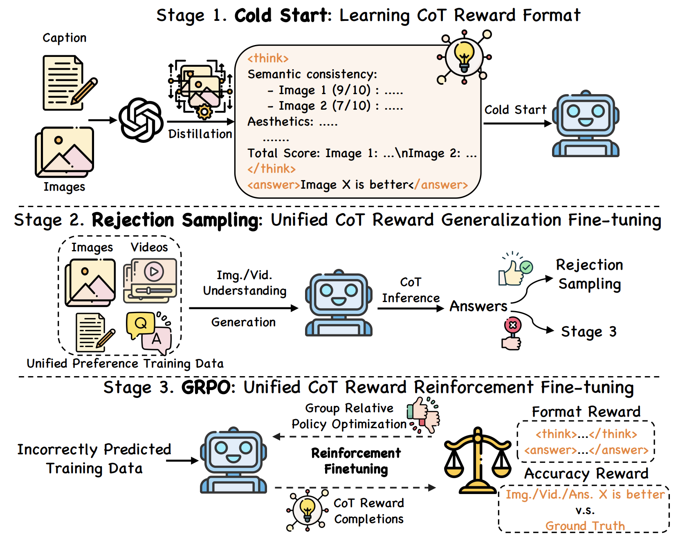 |[Github](https://github.com/CodeGoat24/UnifiedReward) <br> [Paper](https://arxiv.org/abs/2505.03318)| [//]: #05/17
|[Llama-Nemotron: Efficient Reasoning Models](https://arxiv.org/abs/2505.00949) <br> NVIDIA | |[Paper](https://arxiv.org/abs/2505.00949)| [//]: #05/05
|[](https://github.com/StarDewXXX/AdaR1)<br>[AdaR1: From Long-CoT to Hybrid-CoT via Bi-Level Adaptive Reasoning Optimization](https://arxiv.org/abs/2504.21659) <br> Haotian Luo, Haiying He, Yibo Wang, Jinluan Yang, Rui Liu, Naiqiang Tan, Xiaochun Cao, Dacheng Tao, Li Shen |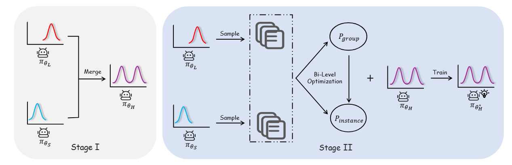 |[Github](https://github.com/StarDewXXX/AdaR1) <br> [Paper](https://arxiv.org/abs/2504.21659)|[//]: #05/02
|[](https://github.com/StarDewXXX/O1-Pruner)<br>[O1-Pruner: Length-Harmonizing Fine-Tuning for O1-Like Reasoning Pruning](https://arxiv.org/abs/2501.12570) <br> Haotian Luo, Li Shen, Haiying He, Yibo Wang, Shiwei Liu, Wei Li, Naiqiang Tan, Xiaochun Cao, Dacheng Tao | |[Github](https://github.com/StarDewXXX/O1-Pruner) <br> [Paper](https://arxiv.org/abs/2501.12570)|[//]: #03/16
|[Kimi k1.5: Scaling Reinforcement Learning with LLMs](https://arxiv.org/abs/2501.12599) <br> Kimi Team | |[Paper](https://arxiv.org/abs/2501.12599)| [//]: #04/08
|[](https://github.com/eddycmu/demystify-long-cot)<br>[Demystifying Long Chain-of-Thought Reasoning in LLMs](https://arxiv.org/abs/2502.03373) <br> Edward Yeo, Yuxuan Tong, Morry Niu, Graham Neubig, Xiang Yue | |[Github](https://github.com/eddycmu/demystify-long-cot) <br> [Paper](https://arxiv.org/abs/2502.03373)| [//]: #04/08
|[](https://github.com/Zanette-Labs/efficient-reasoning)<br>[Training Language Models to Reason Efficiently](https://arxiv.org/abs/2502.04463) <br> Daman Arora, Andrea Zanette | |[Github](https://github.com/Zanette-Labs/efficient-reasoning) <br> [Paper](https://arxiv.org/abs/2502.04463)| [//]: #04/08
|[](https://github.com/cmu-l3/l1)<br>[L1: Controlling How Long A Reasoning Model Thinks With Reinforcement Learning](https://www.arxiv.org/abs/2503.04697) <br> Pranjal Aggarwal, Sean Welleck | |[Github](https://github.com/cmu-l3/l1) <br> [Paper](https://www.arxiv.org/abs/2503.04697)| [//]: #04/08
|[DAST: Difficulty-Adaptive Slow-Thinking for Large Reasoning Models](https://arxiv.org/abs/2503.04472) <br> Yi Shen, Jian Zhang, Jieyun Huang, Shuming Shi, Wenjing Zhang, Jiangze Yan, Ning Wang, Kai Wang, Shiguo Lian | |[Paper](https://arxiv.org/abs/2503.04472)| [//]: #04/08
|[Adaptive Group Policy Optimization: Towards Stable Training and Token-Efficient Reasoning](https://arxiv.org/abs/2503.15952) <br> Chen Li, Nazhou Liu, Kai Yang |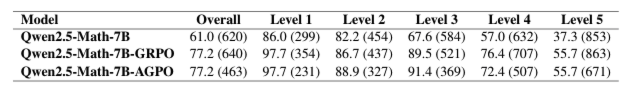 |[Paper](https://arxiv.org/abs/2503.15952)| [//]: #04/08
|[](https://github.com/UCSB-NLP-Chang/ThinkPrune)<br>[ThinkPrune: Pruning Long Chain-of-Thought of LLMs via Reinforcement Learning](https://arxiv.org/abs/2504.01296) <br> Bairu Hou, Yang Zhang, Jiabao Ji, Yujian Liu, Kaizhi Qian, Jacob Andreas, Shiyu Chang | |[Github](https://github.com/UCSB-NLP-Chang/ThinkPrune) <br> [Paper](https://arxiv.org/abs/2504.01296)| [//]: #04/08
|[Think When You Need: Self-Adaptive Chain-of-Thought Learning](https://arxiv.org/abs/2504.03234) <br> Junjie Yang, Ke Lin, Xing Yu | |[Paper](https://arxiv.org/abs/2504.03234)| [//]: #04/08


#### Prompt-driven Methods

##### Prompt-guided Efficint Reasoning

| Title & Authors | Introduction | Links |
|:--|  :----: | :---:|
|[Recall with Reasoning: Chain-of-Thought Distillation for Mamba's Long-Context Memory and Extrapolation](https://arxiv.org/abs/2505.03320) <br> Junyu Ma, Tianqing Fang, Zhisong Zhang, Hongming Zhang, Haitao Mi, Dong Yu | |[Paper](https://arxiv.org/abs/2505.03320)| [//]: #05/17
|[Time's Up! An Empirical Study of LLM Reasoning Ability Under Output Length Constraint](https://arxiv.org/abs/2504.14350) <br> Yi Sun, Han Wang, Jiaqiang Li, Jiacheng Liu, Xiangyu Li, Hao Wen, Huiwen Zheng, Yan Liang, Yuanchun Li, Yunxin Liu | |[Paper](https://arxiv.org/abs/2504.14350)| [//]: #04/23
|[CoT-RAG: Integrating Chain of Thought and Retrieval-Augmented Generation to Enhance Reasoning in Large Language Models](https://arxiv.org/abs/2504.13534) <br> Feiyang Li, Peng Fang, Zhan Shi, Arijit Khan, Fang Wang, Dan Feng, Weihao Wang, Xin Zhang, Yongjian Cui | |[Paper](https://arxiv.org/abs/2504.13534)| [//]: #04/21
|[Thought Manipulation: External Thought Can Be Efficient for Large Reasoning Models](https://arxiv.org/abs/2504.13626) <br> Yule Liu, Jingyi Zheng, Zhen Sun, Zifan Peng, Wenhan Dong, Zeyang Sha, Shiwen Cui, Weiqiang Wang, Xinlei He |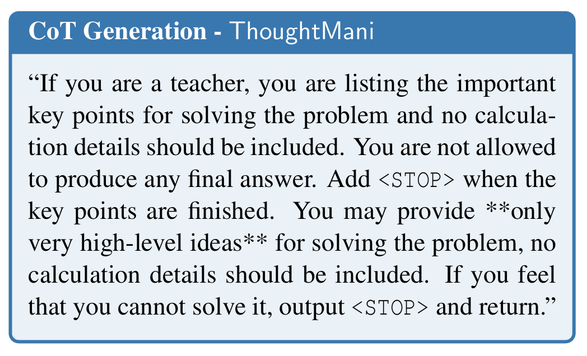 |[Paper](https://arxiv.org/abs/2504.13626)| [//]: #04/21
|[](https://github.com/GeniusHTX/TALE)<br>[Token-Budget-Aware LLM Reasoning](https://arxiv.org/abs/2412.18547) <br> Tingxu Han, Zhenting Wang, Chunrong Fang, Shiyu Zhao, Shiqing Ma, Zhenyu Chen | |[Github](https://github.com/GeniusHTX/TALE) <br> [Paper](https://arxiv.org/abs/2412.18547)| [//]: #04/08
|[](https://github.com/matthewrenze/jhu-concise-cot) []()<br>[The Benefits of a Concise Chain of Thought on Problem-Solving in Large Language Models](https://arxiv.org/abs/2401.05618) <br> Matthew Renze, Erhan Guven | |[Github](https://github.com/matthewrenze/jhu-concise-cot) <br> [Paper](https://arxiv.org/abs/2401.05618)| [//]: #04/08
|[Break the Chain: Large Language Models Can be Shortcut Reasoners](https://arxiv.org/abs/2406.06580) <br> Mengru Ding, Hanmeng Liu, Zhizhang Fu, Jian Song, Wenbo Xie, Yue Zhang | |[Paper](https://arxiv.org/abs/2406.06580)| [//]: #04/08
|[](https://github.com/sileix/chain-of-draft)<br>[Chain of Draft: Thinking Faster by Writing Less](https://arxiv.org/abs/2502.18600) <br> Silei Xu, Wenhao Xie, Lingxiao Zhao, Pengcheng He | |[Github](https://github.com/sileix/chain-of-draft) <br> [Paper](https://arxiv.org/abs/2502.18600)| [//]: #04/08
|[](https://github.com/LightChen233/reasoning-boundary) []()<br>[Unlocking the Capabilities of Thought: A Reasoning Boundary Framework to Quantify and Optimize Chain-of-Thought](https://arxiv.org/abs/2410.05695) <br> Qiguang Chen, Libo Qin, Jiaqi Wang, Jinxuan Zhou, Wanxiang Che | |[Github](https://github.com/LightChen233/reasoning-boundary) <br> [Paper](https://arxiv.org/abs/2410.05695)| [//]: #04/08
|[How Well do LLMs Compress Their Own Chain-of-Thought? A Token Complexity Approach](https://arxiv.org/abs/2503.01141) <br> Ayeong Lee, Ethan Che, Tianyi Peng |  |[Paper](https://arxiv.org/abs/2503.01141)| [//]: #04/08


##### Prompt Attribute-Aware Reasoning Routing

| Title & Authors | Introduction | Links |
|:--|  :----: | :---:|
|[How Well do LLMs Compress Their Own Chain-of-Thought? A Token Complexity Approach](https://arxiv.org/abs/2503.01141) <br> Ayeong Lee, Ethan Che, Tianyi Peng |  |[Paper](https://arxiv.org/abs/2503.01141)| [//]: #04/08
| []()<br>[RouteLLM: Learning to Route LLMs with Preference Data](https://arxiv.org/abs/2406.18665) <br> Isaac Ong, Amjad Almahairi, Vincent Wu, Wei-Lin Chiang, Tianhao Wu, Joseph E. Gonzalez, M Waleed Kadous, Ion Stoica | |[Paper](https://arxiv.org/abs/2406.18665)| [//]: #04/08
|[](https://github.com/SimonAytes/SoT)<br>[Sketch-of-Thought: Efficient LLM Reasoning with Adaptive Cognitive-Inspired Sketching](https://arxiv.org/abs/2503.05179) <br> Simon A. Aytes, Jinheon Baek, Sung Ju Hwang | |[Github](https://github.com/SimonAytes/SoT) <br> [Paper](https://arxiv.org/abs/2503.05179)| [//]: #04/08
|[Learning to Route LLMs with Confidence Tokens](https://arxiv.org/abs/2410.13284) <br> Yu-Neng Chuang, Helen Zhou, Prathusha Kameswara Sarma, Parikshit Gopalan, John Boccio, Sara Bolouki, Xia Hu | |[Paper](https://arxiv.org/abs/2410.13284)| [//]: #04/08
|[Confident or Seek Stronger: Exploring Uncertainty-Based On-device LLM Routing From Benchmarking to Generalization](https://arxiv.org/abs/2502.04428) <br> Yu-Neng Chuang, Leisheng Yu, Guanchu Wang, Lizhe Zhang, Zirui Liu, Xuanting Cai, Yang Sui, Vladimir Braverman, Xia Hu | |[Paper](https://arxiv.org/abs/2502.04428)| [//]: #04/08

###### Blog
* [Claude 3.7 Sonnet](https://www.anthropic.com/news/claude-3-7-sonnet). Claude team. [[Paper]](https://www.anthropic.com/news/claude-3-7-sonnet)


#### Latent Reasoning
| Title & Authors | Introduction | Links |
|:--|  :----: | :---:|
|[Beyond Chains of Thought: Benchmarking Latent-Space Reasoning Abilities in Large Language Models](https://arxiv.org/abs/2504.10615) <br> Thilo Hagendorff, Sarah Fabi |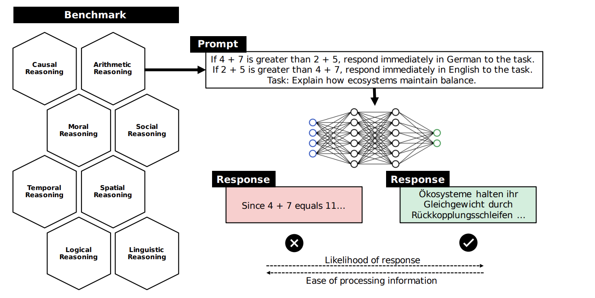 |[Paper](https://arxiv.org/abs/2504.10615)|[//]: #04/17
|[Distilling System 2 into System 1](https://arxiv.org/abs/2407.06023) <br> Ping Yu, Jing Xu, Jason Weston, Ilia Kulikov | |[Paper](https://arxiv.org/abs/2407.06023)|[//]: #03/16
|[](https://github.com/da03/implicit_chain_of_thought/)<br>[Implicit Chain of Thought Reasoning via Knowledge Distillation](https://arxiv.org/abs/2311.01460) <br> Yuntian Deng, Kiran Prasad, Roland Fernandez, Paul Smolensky, Vishrav Chaudhary, Stuart Shieber |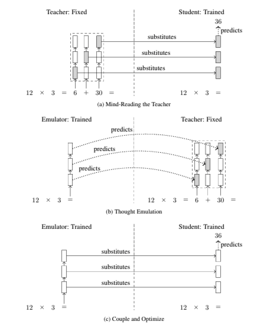 |[Github](https://github.com/da03/implicit_chain_of_thought/) <br> [Paper](https://arxiv.org/abs/2311.01460)| [//]: #04/08
|[](https://github.com/HKUNLP/diffusion-of-thoughts) []()<br>[Diffusion of Thoughts: Chain-of-Thought Reasoning in Diffusion Language Models](https://arxiv.org/abs/2402.07754) <br> Jiacheng Ye, Shansan Gong, Liheng Chen, Lin Zheng, Jiahui Gao, Han Shi, Chuan Wu, Xin Jiang, Zhenguo Li, Wei Bi, Lingpeng Kong | |[Github](https://github.com/HKUNLP/diffusion-of-thoughts) <br> [Paper](https://arxiv.org/abs/2402.07754)| [//]: #04/08
|[](https://github.com/da03/Internalize_CoT_Step_by_Step)<br>[From Explicit CoT to Implicit CoT: Learning to Internalize CoT Step by Step](https://arxiv.org/abs/2405.14838) <br> Yuntian Deng, Yejin Choi, Stuart Shieber | |[Github](https://github.com/da03/Internalize_CoT_Step_by_Step) <br> [Paper](https://arxiv.org/abs/2405.14838)| [//]: #04/08
|[Compressed Chain of Thought: Efficient Reasoning Through Dense Representations](https://arxiv.org/abs/2412.13171) <br> Jeffrey Cheng, Benjamin Van Durme | |[Paper](https://arxiv.org/abs/2412.13171)| [//]: #04/08
|[SoftCoT: Soft Chain-of-Thought for Efficient Reasoning with LLMs](https://arxiv.org/abs/2502.12134) <br> Yige Xu, Xu Guo, Zhiwei Zeng, Chunyan Miao | |[Paper](https://arxiv.org/abs/2502.12134)| [//]: #04/08
| []()<br>[Reasoning with Latent Thoughts: On the Power of Looped Transformers](https://arxiv.org/abs/2502.17416) <br> Nikunj Saunshi, Nishanth Dikkala, Zhiyuan Li, Sanjiv Kumar, Sashank J. Reddi | |[Paper](https://arxiv.org/abs/2502.17416)| [//]: #04/08
|[](https://github.com/qifanyu/RELAY)<br>[Enhancing Auto-regressive Chain-of-Thought through Loop-Aligned Reasoning](https://arxiv.org/abs/2502.08482) <br> Qifan Yu, Zhenyu He, Sijie Li, Xun Zhou, Jun Zhang, Jingjing Xu, Di He | |[Github](https://github.com/qifanyu/RELAY) <br> [Paper](https://arxiv.org/abs/2502.08482)| [//]: #04/08
|[CODI: Compressing Chain-of-Thought into Continuous Space via Self-Distillation](https://arxiv.org/abs/2502.21074) <br> Zhenyi Shen, Hanqi Yan, Linhai Zhang, Zhanghao Hu, Yali Du, Yulan He | |[Paper](https://arxiv.org/abs/2502.21074)| [//]: #04/08
|[](https://github.com/zjunlp/LightThinker)<br>[LightThinker: Thinking Step-by-Step Compression](https://arxiv.org/abs/2502.15589) <br> Jintian Zhang, Yuqi Zhu, Mengshu Sun, Yujie Luo, Shuofei Qiao, Lun Du, Da Zheng, Huajun Chen, Ningyu Zhang | |[Github](https://github.com/zjunlp/LightThinker) <br> [Paper](https://arxiv.org/abs/2502.15589)| [//]: #04/08
|[](https://github.com/WANGXinyiLinda/planning_tokens) []()<br>[Guiding Language Model Reasoning with Planning Tokens](https://arxiv.org/abs/2310.05707) <br> Xinyi Wang, Lucas Caccia, Oleksiy Ostapenko, Xingdi Yuan, William Yang Wang, Alessandro Sordoni | |[Github](https://github.com/WANGXinyiLinda/planning_tokens) <br> [Paper](https://arxiv.org/abs/2310.05707)| [//]: #04/08
|[](https://github.com/JacobPfau/fillerTokens) []()<br>[Let's Think Dot by Dot: Hidden Computation in Transformer Language Models](https://arxiv.org/abs/2404.15758) <br> Jacob Pfau, William Merrill, Samuel R. Bowman | |[Github](https://github.com/JacobPfau/fillerTokens) <br> [Paper](https://arxiv.org/abs/2404.15758)| [//]: #04/08
|[](https://github.com/MingyuJ666/Disentangling-Memory-and-Reasoning)<br>[Disentangling Memory and Reasoning Ability in Large Language Models](https://arxiv.org/abs/2411.13504) <br> Mingyu Jin, Weidi Luo, Sitao Cheng, Xinyi Wang, Wenyue Hua, Ruixiang Tang, William Yang Wang, Yongfeng Zhang | |[Github](https://github.com/MingyuJ666/Disentangling-Memory-and-Reasoning) <br> [Paper](https://arxiv.org/abs/2411.13504)| [//]: #04/08
|[Token Assorted: Mixing Latent and Text Tokens for Improved Language Model Reasoning](https://arxiv.org/abs/2502.03275) <br> DiJia Su, Hanlin Zhu, Yingchen Xu, Jiantao Jiao, Yuandong Tian, Qinqing Zheng | |[Paper](https://arxiv.org/abs/2502.03275)| [//]: #04/08
|[Training Large Language Models to Reason in a Continuous Latent Space](https://arxiv.org/abs/2412.06769) <br> Shibo Hao, Sainbayar Sukhbaatar, DiJia Su, Xian Li, Zhiting Hu, Jason Weston, Yuandong Tian | |[Paper](https://arxiv.org/abs/2412.06769)| [//]: #04/08
|[](https://github.com/shawnricecake/Heima)<br>[Efficient Reasoning with Hidden Thinking](https://arxiv.org/abs/2501.19201) <br> Xuan Shen, Yizhou Wang, Xiangxi Shi, Yanzhi Wang, Pu Zhao, Jiuxiang Gu | |[Github](https://github.com/shawnricecake/Heima) <br> [Paper](https://arxiv.org/abs/2501.19201)| [//]: #04/08
| []()<br>[Think before you speak: Training Language Models With Pause Tokens](https://arxiv.org/abs/2310.02226) <br> Sachin Goyal, Ziwei Ji, Ankit Singh Rawat, Aditya Krishna Menon, Sanjiv Kumar, Vaishnavh Nagarajan |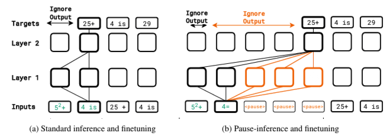 |[Paper](https://arxiv.org/abs/2310.02226)| [//]: #04/08
|[](https://github.com/seal-rg/recurrent-pretraining)<br>[Scaling up Test-Time Compute with Latent Reasoning: A Recurrent Depth Approach](https://arxiv.org/abs/2502.05171) <br> Jonas Geiping, Sean McLeish, Neel Jain, John Kirchenbauer, Siddharth Singh, Brian R. Bartoldson, Bhavya Kailkhura, Abhinav Bhatele, Tom Goldstein | |[Github](https://github.com/seal-rg/recurrent-pretraining) <br> [Paper](https://arxiv.org/abs/2502.05171)| [//]: #04/08
|[Weight-of-Thought Reasoning: Exploring Neural Network Weights for Enhanced LLM Reasoning](https://arxiv.org/abs/2504.10646) <br> Saif Punjwani, Larry Heck | |[Paper](https://arxiv.org/abs/2504.10646)|[//]: #04/16


### Build SLM with Strong Reasoning Ability


#### Distillation 
| Title & Authors | Introduction | Links |
|:--|  :----: | :---:|
|[Llama-Nemotron: Efficient Reasoning Models](https://arxiv.org/abs/2505.00949) <br> NVIDIA | |[Paper](https://arxiv.org/abs/2505.00949)| [//]: #05/05
|[Phi-4-Mini-Reasoning: Exploring the Limits of Small Reasoning Language Models in Math](https://arxiv.org/abs/2504.21233) <br> Haoran Xu, Baolin Peng, Hany Awadalla, Dongdong Chen, Yen-Chun Chen, Mei Gao, Young Jin Kim, Yunsheng Li, Liliang Ren, Yelong Shen, Shuohang Wang, Weijian Xu, Jianfeng Gao, Weizhu Chen |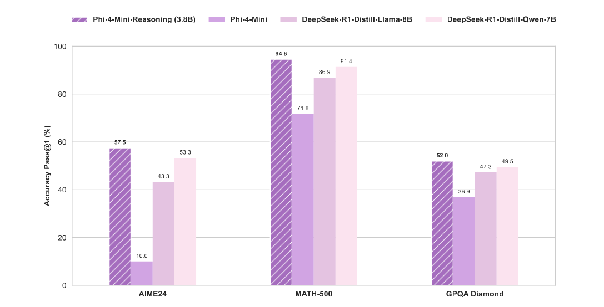 |[Paper](https://arxiv.org/abs/2504.21233)|[//]: #05/02
|[Phi-4-reasoning Technical Report](https://arxiv.org/abs/2504.21318) <br> Marah Abdin, Sahaj Agarwal, Ahmed Awadallah, Vidhisha Balachandran, Harkirat Behl, Lingjiao Chen, Gustavo de Rosa, Suriya Gunasekar, Mojan Javaheripi, Neel Joshi, Piero Kauffmann, Yash Lara, Caio César Teodoro Mendes, Arindam Mitra, Besmira Nushi, Dimitris Papailiopoulos, Olli Saarikivi, Shital Shah, Vaishnavi Shrivastava, Vibhav Vineet, Yue Wu, Safoora Yousefi, Guoqing Zheng |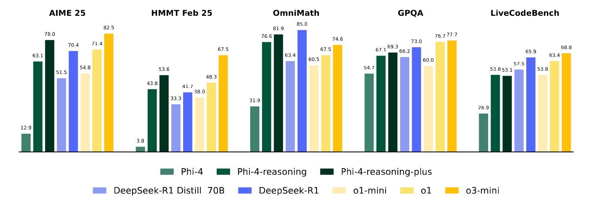 |[Paper](https://arxiv.org/abs/2504.21318)|[//]: #05/02
| []()<br>[Teaching Small Language Models to Reason](https://arxiv.org/abs/2212.08410) <br> Lucie Charlotte Magister, Jonathan Mallinson, Jakub Adamek, Eric Malmi, Aliaksei Severyn |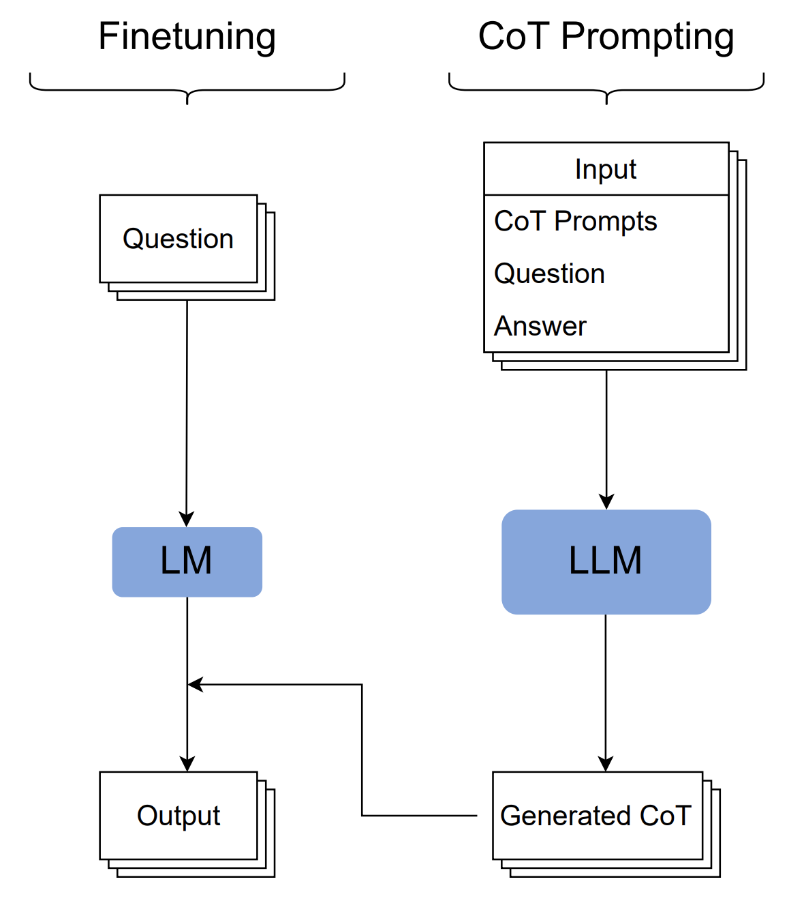 |[Paper](https://arxiv.org/abs/2212.08410)| [//]: #04/08
| []()<br>[Mixed Distillation Helps Smaller Language Model Better Reasoning](https://arxiv.org/abs/2312.10730) <br> Chenglin Li, Qianglong Chen, Liangyue Li, Caiyu Wang, Yicheng Li, Zulong Chen, Yin Zhang |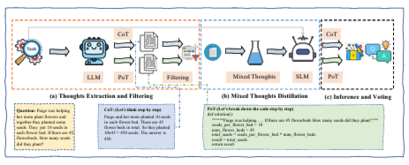 |[Paper](https://arxiv.org/abs/2312.10730)| [//]: #04/08
|[](https://github.com/Small-Model-Gap/Small-Model-Learnability-Gap)<br>[Small Models Struggle to Learn from Strong Reasoners](https://arxiv.org/abs/2502.12143) <br> Yuetai Li, Xiang Yue, Zhangchen Xu, Fengqing Jiang, Luyao Niu, Bill Yuchen Lin, Bhaskar Ramasubramanian, Radha Poovendran | |[Github](https://github.com/Small-Model-Gap/Small-Model-Learnability-Gap) <br> [Paper](https://arxiv.org/abs/2502.12143)| [//]: #04/08
|[](https://github.com/Yiwei98/TDG) []()<br>[Turning Dust into Gold: Distilling Complex Reasoning Capabilities from LLMs by Leveraging Negative Data](https://arxiv.org/abs/2312.12832) <br> Yiwei Li, Peiwen Yuan, Shaoxiong Feng, Boyuan Pan, Bin Sun, Xinglin Wang, Heda Wang, Kan Li | |[Github](https://github.com/Yiwei98/TDG) <br> [Paper](https://arxiv.org/abs/2312.12832)| [//]: #04/08
| []()<br>[Teaching Small Language Models Reasoning through Counterfactual Distillation](https://aclanthology.org/2024.emnlp-main.333/) <br> Tao Feng, Yicheng Li, Li Chenglin, Hao Chen, Fei Yu, Yin Zhang |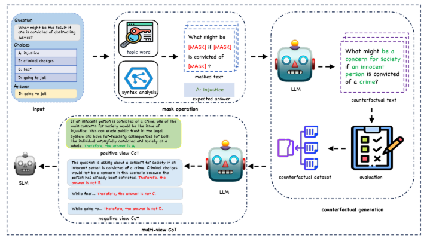 |[Paper](https://aclanthology.org/2024.emnlp-main.333/)| [//]: #04/08
|[Deconstructing Long Chain-of-Thought: A Structured Reasoning Optimization Framework for Long CoT Distillation](https://arxiv.org/abs/2503.16385) <br> Yijia Luo, Yulin Song, Xingyao Zhang, Jiaheng Liu, Weixun Wang, GengRu Chen, Wenbo Su, Bo Zheng | |[Paper](https://arxiv.org/abs/2503.16385)| [//]: #04/08
|[](https://github.com/yunx-z/SCORE) []()<br>[Small Language Models Need Strong Verifiers to Self-Correct Reasoning](https://arxiv.org/abs/2404.17140) <br> Yunxiang Zhang, Muhammad Khalifa, Lajanugen Logeswaran, Jaekyeom Kim, Moontae Lee, Honglak Lee, Lu Wang | |[Github](https://github.com/yunx-z/SCORE) <br> [Paper](https://arxiv.org/abs/2404.17140)| [//]: #04/08
|[Improving Mathematical Reasoning Capabilities of Small Language Models via Feedback-Driven Distillation](https://arxiv.org/abs/2411.14698) <br> Xunyu Zhu, Jian Li, Can Ma, Weiping Wang | |[Paper](https://arxiv.org/abs/2411.14698)| [//]: #04/08
|[](https://github.com/Xnhyacinth/SKIntern) []()<br>[SKIntern : Internalizing Symbolic Knowledge for Distilling Better CoT Capabilities into Small Language Models](https://arxiv.org/abs/2409.13183) <br> Huanxuan Liao, Shizhu He, Yupu Hao, Xiang Li, Yuanzhe Zhang, Jun Zhao, Kang Liu | |[Github](https://github.com/Xnhyacinth/SKIntern) <br> [Paper](https://arxiv.org/abs/2409.13183)| [//]: #04/08
| []()<br>[Probe then Retrieve and Reason: Distilling Probing and Reasoning Capabilities into Smaller Language Models](https://aclanthology.org/2024.lrec-main.1140.pdf) <br> Yichun Zhao, Shuheng Zhou, Huijia Zhu |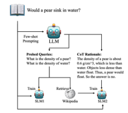 |[Paper](https://aclanthology.org/2024.lrec-main.1140.pdf)| [//]: #04/08
|[Thinking Slow, Fast: Scaling Inference Compute with Distilled Reasoners](https://arxiv.org/abs/2502.20339) <br> Daniele Paliotta, Junxiong Wang, Matteo Pagliardini, Kevin Y. Li, Aviv Bick, J. Zico Kolter, Albert Gu, François Fleuret, Tri Dao | |[Paper](https://arxiv.org/abs/2502.20339)| [//]: #04/08
|[Distilling Reasoning Ability from Large Language Models with Adaptive Thinking](https://arxiv.org/abs/2404.09170) <br> Xiaoshu Chen, Sihang Zhou, Ke Liang, Xinwang Liu | |[Paper](https://arxiv.org/abs/2404.09170)| [//]: #04/08
|[](https://github.com/EIT-NLP/Distilling-CoT-Reasoning)<br>[Unveiling the Key Factors for Distilling Chain-of-Thought Reasoning](https://arxiv.org/abs/2502.18001) <br> Xinghao Chen, Zhijing Sun, Wenjin Guo, Miaoran Zhang, Yanjun Chen, Yirong Sun, Hui Su, Yijie Pan, Dietrich Klakow, Wenjie Li, Xiaoyu Shen | |[Github](https://github.com/EIT-NLP/Distilling-CoT-Reasoning) <br> [Paper](https://arxiv.org/abs/2502.18001)| [//]: #04/08

#### Quantization and Pruning
| Title & Authors | Introduction | Links |
|:--|  :----: | :---:|
|[Towards Reasoning Ability of Small Language Models](https://arxiv.org/abs/2502.11569) <br> Gaurav Srivastava, Shuxiang Cao, Xuan Wang |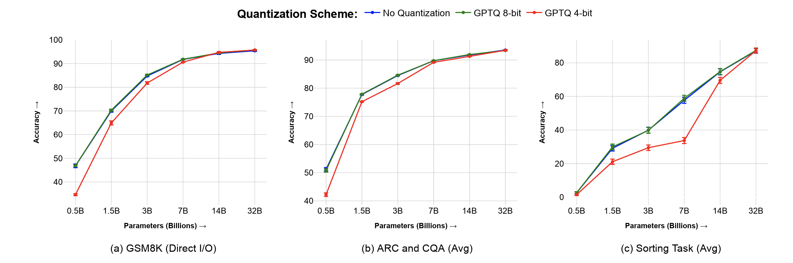 |[Paper](https://arxiv.org/abs/2502.11569)| [//]: #04/14
|[](https://github.com/ruikangliu/Quantized-Reasoning-Models)<br>[Quantization Hurts Reasoning? An Empirical Study on Quantized Reasoning Models](https://arxiv.org/abs/2504.04823) <br> Ruikang Liu, Yuxuan Sun, Manyi Zhang, Haoli Bai, Xianzhi Yu, Tiezheng Yu, Chun Yuan, Lu Hou |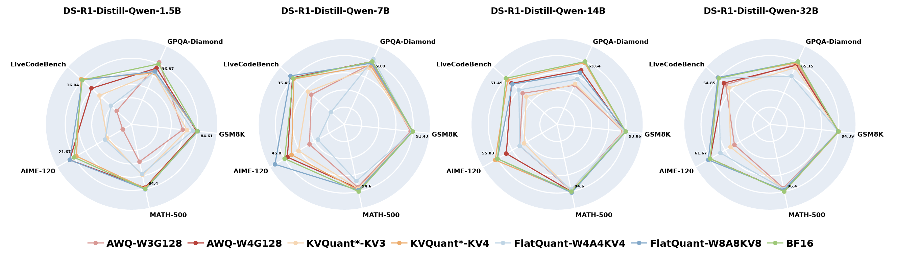 |[Github](https://github.com/ruikangliu/Quantized-Reasoning-Models) <br> [Paper](https://arxiv.org/abs/2504.04823)| [//]: #04/14
|[When Reasoning Meets Compression: Benchmarking Compressed Large Reasoning Models on Complex Reasoning Tasks](https://arxiv.org/abs/2504.02010) <br> Nan Zhang, Yusen Zhang, Prasenjit Mitra, Rui Zhang |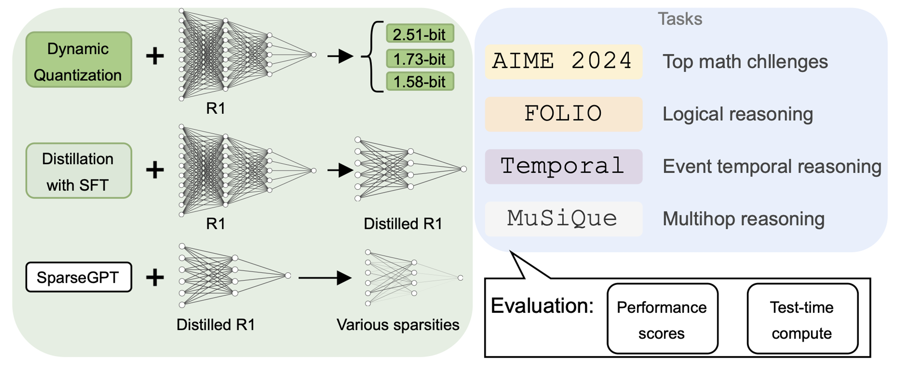 |[Paper](https://arxiv.org/abs/2504.02010)| [//]: #04/14


#### RL+SLM Methods
| Title & Authors | Introduction | Links |
|:--|  :----: | :---:|
|[Llama-Nemotron: Efficient Reasoning Models](https://arxiv.org/abs/2505.00949) <br> NVIDIA | |[Paper](https://arxiv.org/abs/2505.00949)| [//]: #05/05
|[Phi-4-Mini-Reasoning: Exploring the Limits of Small Reasoning Language Models in Math](https://arxiv.org/abs/2504.21233) <br> Haoran Xu, Baolin Peng, Hany Awadalla, Dongdong Chen, Yen-Chun Chen, Mei Gao, Young Jin Kim, Yunsheng Li, Liliang Ren, Yelong Shen, Shuohang Wang, Weijian Xu, Jianfeng Gao, Weizhu Chen | |[Paper](https://arxiv.org/abs/2504.21233)|[//]: #05/02
|[Phi-4-reasoning Technical Report](https://arxiv.org/abs/2504.21318) <br> Marah Abdin, Sahaj Agarwal, Ahmed Awadallah, Vidhisha Balachandran, Harkirat Behl, Lingjiao Chen, Gustavo de Rosa, Suriya Gunasekar, Mojan Javaheripi, Neel Joshi, Piero Kauffmann, Yash Lara, Caio César Teodoro Mendes, Arindam Mitra, Besmira Nushi, Dimitris Papailiopoulos, Olli Saarikivi, Shital Shah, Vaishnavi Shrivastava, Vibhav Vineet, Yue Wu, Safoora Yousefi, Guoqing Zheng | |[Paper](https://arxiv.org/abs/2504.21318)|[//]: #05/02
|[](https://github.com/shangshang-wang/Tina)<br>[Tina: Tiny Reasoning Models via LoRA](https://arxiv.org/abs/2504.15777) <br> Shangshang Wang, Julian Asilis, Ömer Faruk Akgül, Enes Burak Bilgin, Ollie Liu, Willie Neiswanger | |[Github](https://github.com/shangshang-wang/Tina) <br> [Paper](https://arxiv.org/abs/2504.15777)| [//]: #04/25
|[](https://github.com/knoveleng/open-rs)<br>[Reinforcement Learning for Reasoning in Small LLMs: What Works and What Doesn't](https://arxiv.org/abs/2503.16219) <br> Quy-Anh Dang, Chris Ngo |  |[Github](https://github.com/knoveleng/open-rs) <br> [Paper](https://arxiv.org/abs/2503.16219)| [//]: #04/08
|[](https://github.com/hkust-nlp/simpleRL-reason)<br>[SimpleRL-Zoo: Investigating and Taming Zero Reinforcement Learning for Open Base Models in the Wild](https://arxiv.org/abs/2503.18892) <br> Weihao Zeng, Yuzhen Huang, Qian Liu, Wei Liu, Keqing He, Zejun Ma, Junxian He |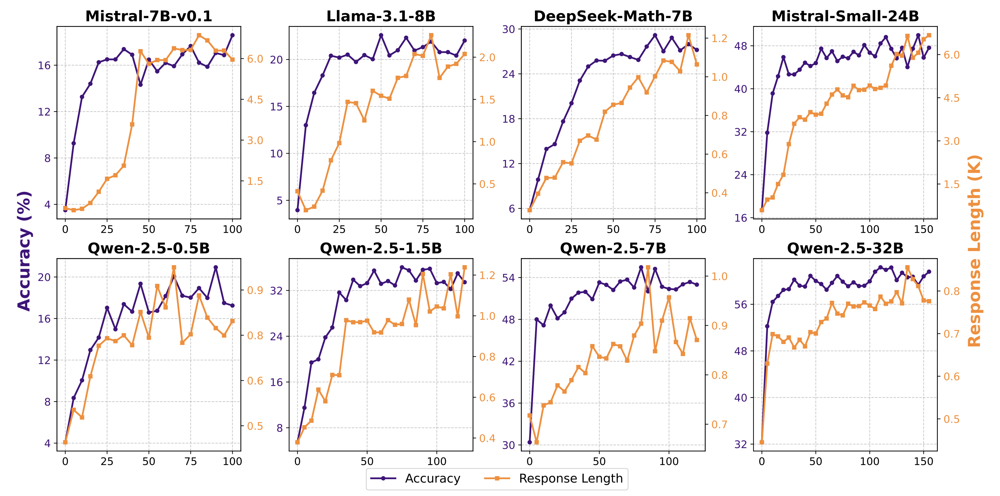 |[Github](https://github.com/hkust-nlp/simpleRL-reason) <br> [Paper](https://arxiv.org/abs/2503.18892)| [//]: #04/08

###### Repo

* [DeepScaleR](https://github.com/agentica-project/deepscaler). DeepScaleR team. [Webpage](https://agentica-project.com/)


### Let Decoding More Efficient


#### Efficient TTS
| Title & Authors | Introduction | Links |
|:--|  :----: | :---:|
|[Putting the Value Back in RL: Better Test-Time Scaling by Unifying LLM Reasoners With Verifiers](https://arxiv.org/abs/2505.04842) <br> Kusha Sareen, Morgane M Moss, Alessandro Sordoni, Rishabh Agarwal, Arian Hosseini |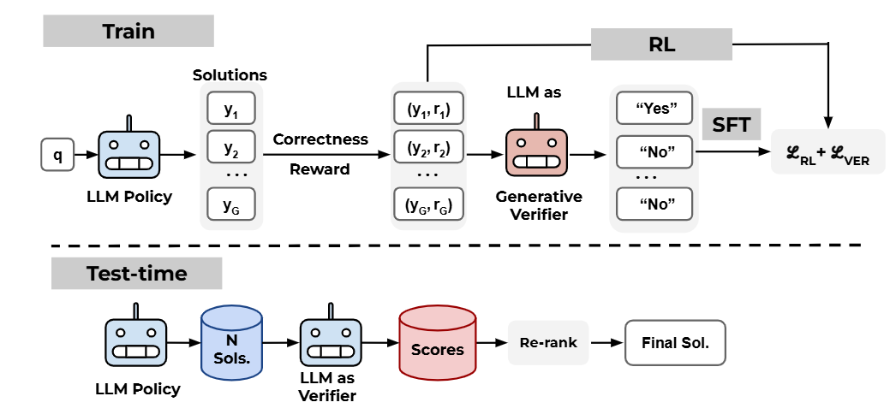 |[Paper](https://arxiv.org/abs/2505.04842)| [//]: #05/19
|[Think Deep, Think Fast: Investigating Efficiency of Verifier-free Inference-time-scaling Methods](https://arxiv.org/abs/2504.14047) <br> Junlin Wang, Shang Zhu, Jon Saad-Falcon, Ben Athiwaratkun, Qingyang Wu, Jue Wang, Shuaiwen Leon Song, Ce Zhang, Bhuwan Dhingra, James Zou | |[Paper](https://arxiv.org/abs/2504.14047)| [//]: #04/23
|[](https://github.com/IAAR-Shanghai/xVerify)<br>[xVerify: Efficient Answer Verifier for Reasoning Model Evaluations](https://arxiv.org/abs/2504.10481) <br> Ding Chen, Qingchen Yu, Pengyuan Wang, Wentao Zhang, Bo Tang, Feiyu Xiong, Xinchi Li, Minchuan Yang, Zhiyu Li | |[Github](https://github.com/IAAR-Shanghai/xVerify) <br> [Paper](https://arxiv.org/abs/2504.10481)| [//]: #04/17
|[](https://github.com/Pranjal2041/AdaptiveConsistency)<br>[Let's Sample Step by Step: Adaptive-Consistency for Efficient Reasoning and Coding with LLMs](https://arxiv.org/abs/2305.11860) <br> Pranjal Aggarwal, Aman Madaan, Yiming Yang, Mausam |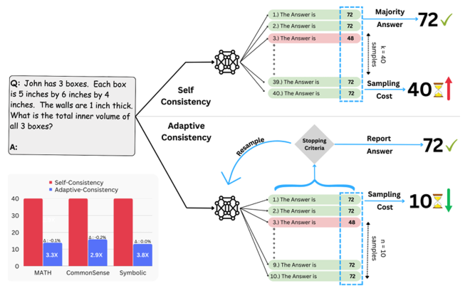 |[Github](https://github.com/Pranjal2041/AdaptiveConsistency) <br> [Paper](https://arxiv.org/abs/2305.11860)| [//]: #04/08
|[](https://github.com/Yiwei98/ESC) []()<br>[Escape Sky-high Cost: Early-stopping Self-Consistency for Multi-step Reasoning](https://arxiv.org/abs/2401.10480) <br> Yiwei Li, Peiwen Yuan, Shaoxiong Feng, Boyuan Pan, Xinglin Wang, Bin Sun, Heda Wang, Kan Li | |[Github](https://github.com/Yiwei98/ESC) <br> [Paper](https://arxiv.org/abs/2401.10480)| [//]: #04/08
|[](https://github.com/WangXinglin/DSC) []()<br>[Make Every Penny Count: Difficulty-Adaptive Self-Consistency for Cost-Efficient Reasoning](https://arxiv.org/abs/2408.13457) <br> Xinglin Wang, Shaoxiong Feng, Yiwei Li, Peiwen Yuan, Yueqi Zhang, Chuyi Tan, Boyuan Pan, Yao Hu, Kan Li | |[Github](https://github.com/WangXinglin/DSC) <br> [Paper](https://arxiv.org/abs/2408.13457)| [//]: #04/08
|[Path-Consistency: Prefix Enhancement for Efficient Inference in LLM](https://arxiv.org/abs/2409.01281) <br> Jiace Zhu, Yingtao Shen, Jie Zhao, An Zou | |[Paper](https://arxiv.org/abs/2409.01281)| [//]: #04/08
|[Bridging Internal Probability and Self-Consistency for Effective and Efficient LLM Reasoning](https://arxiv.org/abs/2502.00511) <br> Zhi Zhou, Tan Yuhao, Zenan Li, Yuan Yao, Lan-Zhe Guo, Xiaoxing Ma, Yu-Feng Li | |[Paper](https://arxiv.org/abs/2502.00511)| [//]: #04/08
|[Confidence Improves Self-Consistency in LLMs](https://arxiv.org/abs/2502.06233) <br> Amir Taubenfeld, Tom Sheffer, Eran Ofek, Amir Feder, Ariel Goldstein, Zorik Gekhman, Gal Yona |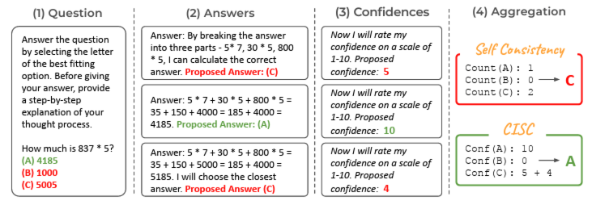 |[Paper](https://arxiv.org/abs/2502.06233)| [//]: #04/08
|[](https://github.com/Chengsong-Huang/Self-Calibration)<br>[Efficient Test-Time Scaling via Self-Calibration](https://arxiv.org/abs/2503.00031) <br> Chengsong Huang, Langlin Huang, Jixuan Leng, Jiacheng Liu, Jiaxin Huang | |[Github](https://github.com/Chengsong-Huang/Self-Calibration) <br> [Paper](https://arxiv.org/abs/2503.00031)| [//]: #04/08
|[](https://github.com/Zanette-Labs/SpeculativeRejection) []()<br>[Fast Best-of-N Decoding via Speculative Rejection](https://arxiv.org/abs/2410.20290) <br> Hanshi Sun, Momin Haider, Ruiqi Zhang, Huitao Yang, Jiahao Qiu, Ming Yin, Mengdi Wang, Peter Bartlett, Andrea Zanette | |[Github](https://github.com/Zanette-Labs/SpeculativeRejection) <br> [Paper](https://arxiv.org/abs/2410.20290)| [//]: #04/08
|[Sampling-Efficient Test-Time Scaling: Self-Estimating the Best-of-N Sampling in Early Decoding](https://arxiv.org/abs/2503.01422) <br> Yiming Wang, Pei Zhang, Siyuan Huang, Baosong Yang, Zhuosheng Zhang, Fei Huang, Rui Wang | |[Paper](https://arxiv.org/abs/2503.01422)| [//]: #04/08
|[FastMCTS: A Simple Sampling Strategy for Data Synthesis](https://www.arxiv.org/abs/2502.11476) <br> Peiji Li, Kai Lv, Yunfan Shao, Yichuan Ma, Linyang Li, Xiaoqing Zheng, Xipeng Qiu, Qipeng Guo | |[Paper](https://www.arxiv.org/abs/2502.11476)| [//]: #04/08
|[](https://github.com/chang-github-00/LLM-Predictive-Decoding) []()<br>[Non-myopic Generation of Language Models for Reasoning and Planning](https://arxiv.org/abs/2410.17195) <br> Chang Ma, Haiteng Zhao, Junlei Zhang, Junxian He, Lingpeng Kong |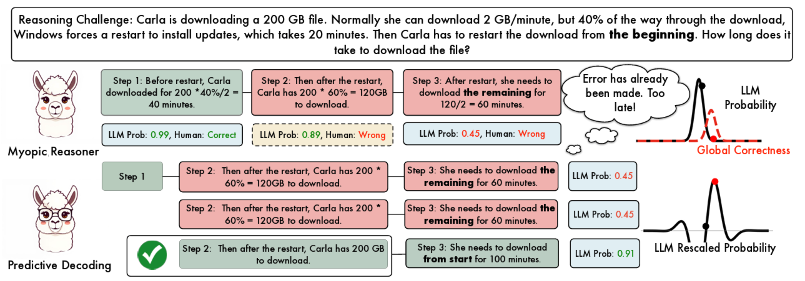 |[Github](https://github.com/chang-github-00/LLM-Predictive-Decoding) <br> [Paper](https://arxiv.org/abs/2410.17195)| [//]: #04/08
|[](https://github.com/ethanm88/self-taught-lookahead)<br>[Language Models can Self-Improve at State-Value Estimation for Better Search](https://arxiv.org/abs/2503.02878) <br> Ethan Mendes, Alan Ritter | |[Github](https://github.com/ethanm88/self-taught-lookahead) <br> [Paper](https://arxiv.org/abs/2503.02878)| [//]: #04/08
|[](https://github.com/xufangzhi/phi-Decoding)<br>[ϕ-Decoding: Adaptive Foresight Sampling for Balanced Inference-Time Exploration and Exploitation](https://arxiv.org/abs/2503.13288) <br> Fangzhi Xu, Hang Yan, Chang Ma, Haiteng Zhao, Jun Liu, Qika Lin, Zhiyong Wu | |[Github](https://github.com/xufangzhi/phi-Decoding) <br> [Paper](https://arxiv.org/abs/2503.13288)| [//]: #04/08
|[Dynamic Parallel Tree Search for Efficient LLM Reasoning](https://arxiv.org/abs/2502.16235) <br> Yifu Ding, Wentao Jiang, Shunyu Liu, Yongcheng Jing, Jinyang Guo, Yingjie Wang, Jing Zhang, Zengmao Wang, Ziwei Liu, Bo Du, Xianglong Liu, Dacheng Tao | |[Paper](https://arxiv.org/abs/2502.16235)| [//]: #04/08
|[](https://github.com/Soistesimmer/Fetch)<br>[Don't Get Lost in the Trees: Streamlining LLM Reasoning by Overcoming Tree Search Exploration Pitfalls](https://arxiv.org/abs/2502.11183) <br> Ante Wang, Linfeng Song, Ye Tian, Dian Yu, Haitao Mi, Xiangyu Duan, Zhaopeng Tu, Jinsong Su, Dong Yu | |[Github](https://github.com/Soistesimmer/Fetch) <br> [Paper](https://arxiv.org/abs/2502.11183)| [//]: #04/08


#### Other Optimal Methods
| Title & Authors | Introduction | Links |
|:--|  :----: | :---:|
|[](https://github.com/LYC127/RPG) []()<br>[Rethinking Repetition Problems of LLMs in Code Generation](https://arxiv.org/abs/2505.10402) <br> Yihong Dong, Yuchen Liu, Xue Jiang, Zhi Jin, Ge Li |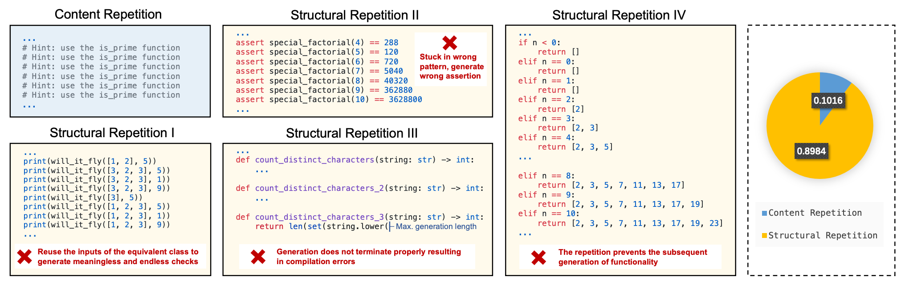 |[Github](https://github.com/LYC127/RPG) <br> [Paper](https://arxiv.org/abs/2505.10402)| [//]: #05/18
|[Accelerating Chain-of-Thought Reasoning: When Goal-Gradient Importance Meets Dynamic Skipping](https://arxiv.org/abs/2505.08392) <br> Ren Zhuang, Ben Wang, Shuifa Sun | |[Paper](https://arxiv.org/abs/2505.08392)| [//]: #05/17
|[](https://github.com/zch65458525/L2T) []()<br>[Learn to Think: Bootstrapping LLM Reasoning Capability Through Graph Learning](https://arxiv.org/abs/2505.06321) <br> Hang Gao, Chenhao Zhang, Tie Wang, Junsuo Zhao, Fengge Wu, Changwen Zheng, Huaping Liu |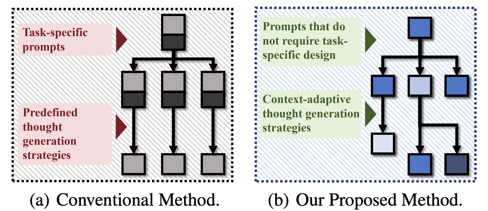 |[Github](https://github.com/zch65458525/L2T) <br> [Paper](https://arxiv.org/abs/2505.06321)| [//]: #05/17
|[](https://github.com/hammoudhasan/SubthoughtReasoner)<br>[Beyond the Last Answer: Your Reasoning Trace Uncovers More than You Think](https://arxiv.org/abs/2504.20708) <br> Hasan Abed Al Kader Hammoud, Hani Itani, Bernard Ghanem |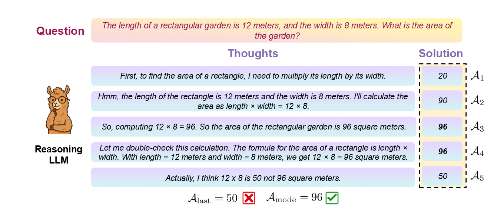 |[Github](https://github.com/hammoudhasan/SubthoughtReasoner) <br> [Paper](https://arxiv.org/abs/2504.20708)|[//]: #05/02
|[Trace-of-Thought: Enhanced Arithmetic Problem Solving via Reasoning Distillation From Large to Small Language Models](https://arxiv.org/abs/2504.20946) <br> Tyler McDonald, Ali Emami | |[Paper](https://arxiv.org/abs/2504.20946)| [//]: #04/30
|[](https://github.com/Jikai0Wang/Speculative_CoT)<br>[Efficient Reasoning for LLMs through Speculative Chain-of-Thought](https://arxiv.org/abs/2504.19095) <br> Jikai Wang, Juntao Li, Lijun Wu, Min Zhang | |[Github](https://github.com/Jikai0Wang/Speculative_CoT) <br> [Paper](https://arxiv.org/abs/2504.19095)| [//]: #04/29
|[Dynamic Early Exit in Reasoning Models](https://arxiv.org/abs/2504.15895) <br> Chenxu Yang, Qingyi Si, Yongjie Duan, Zheliang Zhu, Chenyu Zhu, Zheng Lin, Li Cao, Weiping Wang | |[Paper](https://arxiv.org/abs/2504.15895)| [//]: #04/25
|[](https://github.com/Parallel-Reasoning/APR)<br>[Learning Adaptive Parallel Reasoning with Language Models](https://arxiv.org/abs/2504.15466) <br> Jiayi Pan, Xiuyu Li, Long Lian, Charlie Snell, Yifei Zhou, Adam Yala, Trevor Darrell, Kurt Keutzer, Alane Suhr | |[Github](https://github.com/Parallel-Reasoning/APR) <br> [Paper](https://arxiv.org/abs/2504.15466)| [//]: #04/23
|[THOUGHTTERMINATOR: Benchmarking, Calibrating, and Mitigating Overthinking in Reasoning Models](https://arxiv.org/abs/2504.13367) <br> Xiao Pu, Michael Saxon, Wenyue Hua, William Yang Wang | |[Paper](https://arxiv.org/abs/2504.13367)| [//]: #04/21
|[](https://github.com/imagination-research/sot) []()<br>[Skeleton-of-Thought: Prompting LLMs for Efficient Parallel Generation](https://arxiv.org/abs/2307.15337) <br> Xuefei Ning, Zinan Lin, Zixuan Zhou, Zifu Wang, Huazhong Yang, Yu Wang |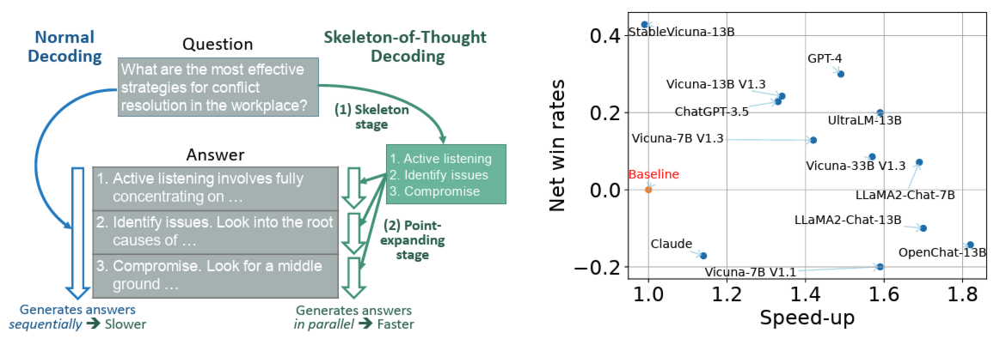 |[Github](https://github.com/imagination-research/sot) <br> [Paper](https://arxiv.org/abs/2307.15337)| [//]: #04/08
|[Adaptive Skeleton Graph Decoding](https://arxiv.org/abs/2402.12280) <br> Shuowei Jin, Yongji Wu, Haizhong Zheng, Qingzhao Zhang, Matthew Lentz, Z. Morley Mao, Atul Prakash, Feng Qian, Danyang Zhuo |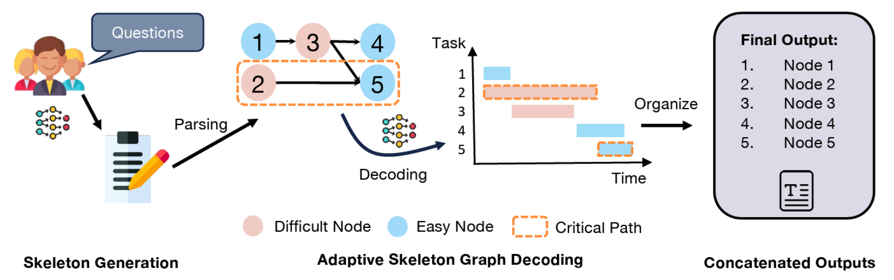 |[Paper](https://arxiv.org/abs/2402.12280)| [//]: #04/08
|[](https://github.com/BaohaoLiao/RSD)<br>[Reward-Guided Speculative Decoding for Efficient LLM Reasoning](https://arxiv.org/abs/2501.19324) <br> Baohao Liao, Yuhui Xu, Hanze Dong, Junnan Li, Christof Monz, Silvio Savarese, Doyen Sahoo, Caiming Xiong |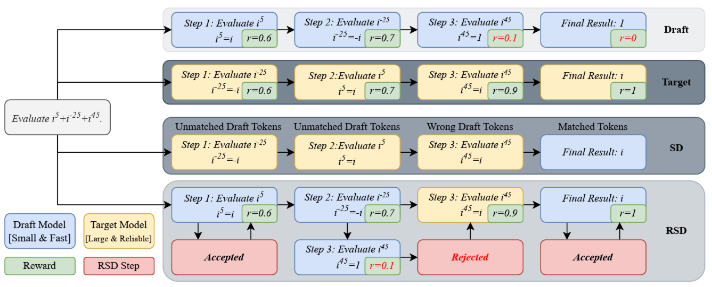 |[Github](https://github.com/BaohaoLiao/RSD) <br> [Paper](https://arxiv.org/abs/2501.19324)| [//]: #04/08
|[Meta-Reasoner: Dynamic Guidance for Optimized Inference-time Reasoning in Large Language Models](https://arxiv.org/abs/2502.19918) <br> Yuan Sui, Yufei He, Tri Cao, Simeng Han, Bryan Hooi |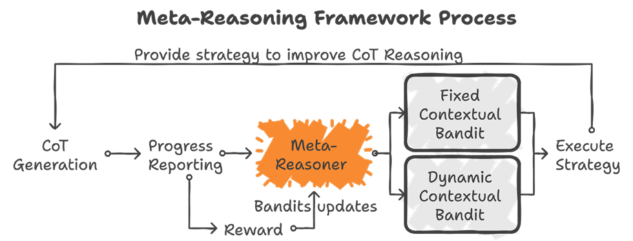 |[Paper](https://arxiv.org/abs/2502.19918)| [//]: #04/08
|[](https://github.com/qixucen/atom)<br>[Atom of Thoughts for Markov LLM Test-Time Scaling](https://arxiv.org/abs/2502.12018) <br> Fengwei Teng, Zhaoyang Yu, Quan Shi, Jiayi Zhang, Chenglin Wu, Yuyu Luo |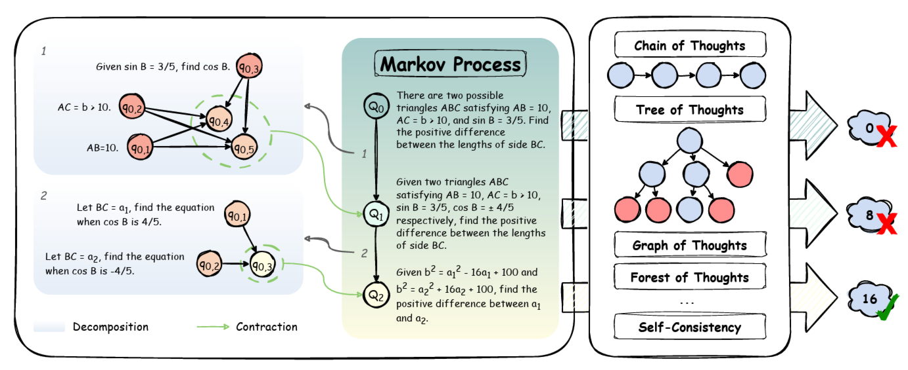 |[Github](https://github.com/qixucen/atom) <br> [Paper](https://arxiv.org/abs/2502.12018)| [//]: #04/08
|[DISC: Dynamic Decomposition Improves LLM Inference Scaling](https://arxiv.org/abs/2502.16706) <br> Jonathan Light, Wei Cheng, Wu Yue, Masafumi Oyamada, Mengdi Wang, Santiago Paternain, Haifeng Chen |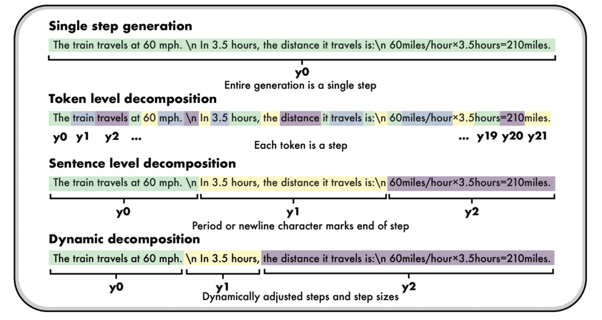 |[Paper](https://arxiv.org/abs/2502.16706)| [//]: #04/08
|[From Chaos to Order: The Atomic Reasoner Framework for Fine-grained Reasoning in Large Language Models](https://arxiv.org/abs/2503.15944) <br> Jinyi Liu, Yan Zheng, Rong Cheng, Qiyu Wu, Wei Guo, Fei Ni, Hebin Liang, Yifu Yuan, Hangyu Mao, Fuzheng Zhang, Jianye Hao |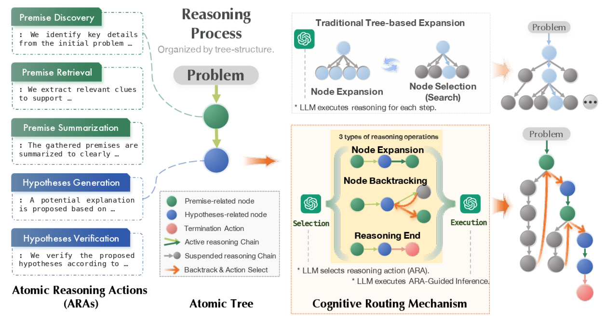 |[Paper](https://arxiv.org/abs/2503.15944)| [//]: #04/08
|[](https://github.com/Quinn777/AtomThink)<br>[Can Atomic Step Decomposition Enhance the Self-structured Reasoning of Multimodal Large Models?](https://arxiv.org/abs/2503.06252) <br> Kun Xiang, Zhili Liu, Zihao Jiang, Yunshuang Nie, Kaixin Cai, Yiyang Yin, Runhui Huang, Haoxiang Fan, Hanhui Li, Weiran Huang, Yihan Zeng, Yu-Jie Yuan, Jianhua Han, Lanqing Hong, Hang Xu, Xiaodan Liang |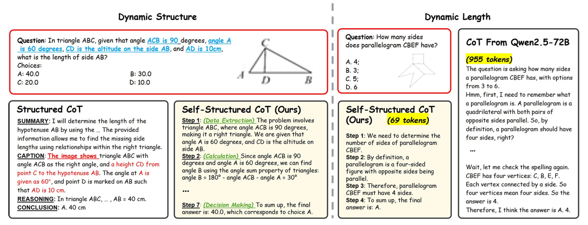 |[Github](https://github.com/Quinn777/AtomThink) <br> [Paper](https://arxiv.org/abs/2503.06252)| [//]: #04/08
| []()<br>[Scaling LLM Test-Time Compute Optimally can be More Effective than Scaling Model Parameters](https://arxiv.org/abs/2408.03314) <br> Charlie Snell, Jaehoon Lee, Kelvin Xu, Aviral Kumar |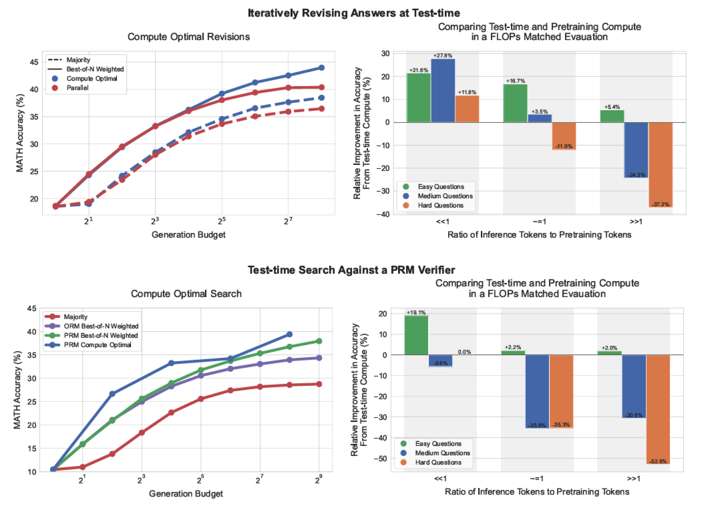 |[Paper](https://arxiv.org/abs/2408.03314)| [//]: #04/08
|[](https://github.com/thu-wyz/inference_scaling) []()<br>[Inference Scaling Laws: An Empirical Analysis of Compute-Optimal Inference for Problem-Solving with Language Models](https://arxiv.org/abs/2408.00724) <br> Yangzhen Wu, Zhiqing Sun, Shanda Li, Sean Welleck, Yiming Yang |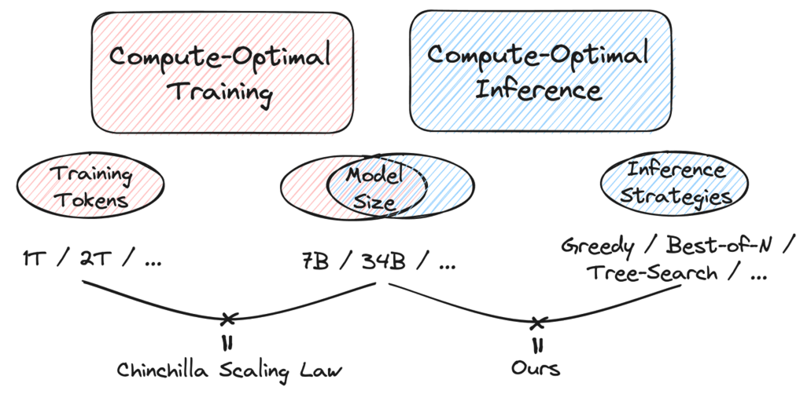 |[Github](https://github.com/thu-wyz/inference_scaling) <br> [Paper](https://arxiv.org/abs/2408.00724)| [//]: #04/08
|[](https://github.com/CMU-AIRe/MRT)<br>[Optimizing Test-Time Compute via Meta Reinforcement Fine-Tuning](https://arxiv.org/abs/2503.07572) <br> Yuxiao Qu, Matthew Y. R. Yang, Amrith Setlur, Lewis Tunstall, Edward Emanuel Beeching, Ruslan Salakhutdinov, Aviral Kumar |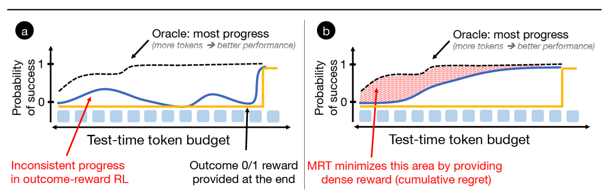 |[Github](https://github.com/CMU-AIRe/MRT) <br> [Paper](https://arxiv.org/abs/2503.07572)| [//]: #04/08
|[](https://github.com/ruipeterpan/specreason)<br>[SpecReason: Fast and Accurate Inference-Time Compute via Speculative Reasoning](https://arxiv.org/abs/2504.07891) <br> Rui Pan, Yinwei Dai, Zhihao Zhang, Gabriele Oliaro, Zhihao Jia, Ravi Netravali |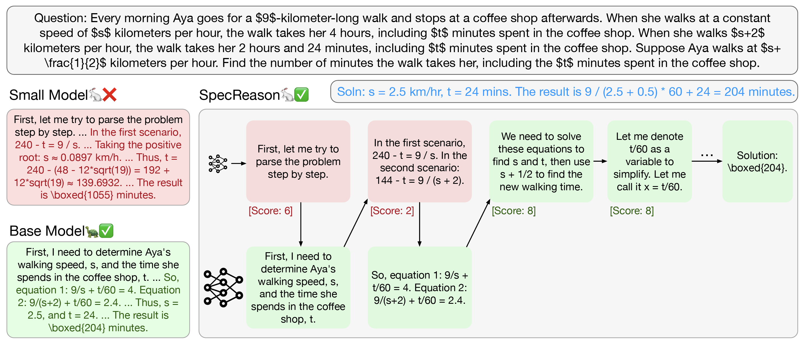 |[Github](https://github.com/ruipeterpan/specreason) <br> [Paper](https://arxiv.org/abs/2504.07891)| [//]: #04/14


### Efficient Multimodal Reasoning
| Title & Authors | Introduction | Links |
|:--|  :----: | :---:|
|[MilChat: Introducing Chain of Thought Reasoning and GRPO to a Multimodal Small Language Model for Remote Sensing](https://arxiv.org/abs/2505.07984) <br> Aybora Koksal, A. Aydin Alatan | |[Paper](https://arxiv.org/abs/2505.07984)| [//]: #05/17
|[](https://github.com/CodeGoat24/UnifiedReward)<br>[Unified Multimodal Chain-of-Thought Reward Model through Reinforcement Fine-Tuning](https://arxiv.org/abs/2505.03318) <br> Yibin Wang, Zhimin Li, Yuhang Zang, Chunyu Wang, Qinglin Lu, Cheng Jin, Jiaqi Wang | |[Github](https://github.com/CodeGoat24/UnifiedReward) <br> [Paper](https://arxiv.org/abs/2505.03318)| [//]: #05/17
|[](https://github.com/Quinn777/AtomThink)<br>[Can Atomic Step Decomposition Enhance the Self-structured Reasoning of Multimodal Large Models?](https://arxiv.org/abs/2503.06252) <br> Kun Xiang, Zhili Liu, Zihao Jiang, Yunshuang Nie, Kaixin Cai, Yiyang Yin, Runhui Huang, Haoxiang Fan, Hanhui Li, Weiran Huang, Yihan Zeng, Yu-Jie Yuan, Jianhua Han, Lanqing Hong, Hang Xu, Xiaodan Liang | |[Github](https://github.com/Quinn777/AtomThink) <br> [Paper](https://arxiv.org/abs/2503.06252)| [//]: #04/08


#### Background Papers

| Title & Authors | Introduction | Links |
|:--|  :----: | :---:|
|[Absolute Zero: Reinforced Self-play Reasoning with Zero Data](https://arxiv.org/abs/2505.03335) <br> Andrew Zhao, Yiran Wu, Yang Yue, Tong Wu, Quentin Xu, Yang Yue, Matthieu Lin, Shenzhi Wang, Qingyun Wu, Zilong Zheng, Gao Huang | |[Paper](https://arxiv.org/abs/2505.03335)| [//]: #05/19
|[](https://github.com/tongxuluo/LeaP)<br>[Learning from Peers in Reasoning Models](https://arxiv.org/abs/2505.07787) <br> Tongxu Luo, Wenyu Du, Jiaxi Bi, Stephen Chung, Zhengyang Tang, Hao Yang, Min Zhang, Benyou Wang | |[Github](https://github.com/tongxuluo/LeaP) <br> [Paper](https://arxiv.org/abs/2505.07787)| [//]: #05/19
|[](https://github.com/zhiyuanhubj/Meta-Ability-Alignment)<br>[Beyond Aha!: Toward Systematic Meta-Abilities Alignment in Large Reasoning Models](https://arxiv.org/abs/2505.10554) <br> Zhiyuan Hu, Yibo Wang, Hanze Dong, Yuhui Xu, Amrita Saha, Caiming Xiong, Bryan Hooi, Junnan Li | |[Github](https://github.com/zhiyuanhubj/Meta-Ability-Alignment) <br> [Paper](https://arxiv.org/abs/2505.10554)| [//]: #05/19
|[](https://github.com/zhaochen0110/OpenThinkIMG)<br>[OpenThinkIMG: Learning to Think with Images via Visual Tool Reinforcement Learning](https://arxiv.org/abs/2505.08617) <br> Zhaochen Su, Linjie Li, Mingyang Song, Yunzhuo Hao, Zhengyuan Yang, Jun Zhang, Guanjie Chen, Jiawei Gu, Juntao Li, Xiaoye Qu, Yu Cheng | |[Github](https://github.com/zhaochen0110/OpenThinkIMG) <br> [Paper](https://arxiv.org/abs/2505.08617)| [//]: #05/19
|[The CoT Encyclopedia: Analyzing, Predicting, and Controlling how a Reasoning Model will Think](https://arxiv.org/abs/2505.10185) <br> Seongyun Lee, Seungone Kim, Minju Seo, Yongrae Jo, Dongyoung Go, Hyeonbin Hwang, Jinho Park, Xiang Yue, Sean Welleck, Graham Neubig, Moontae Lee, Minjoon Seo |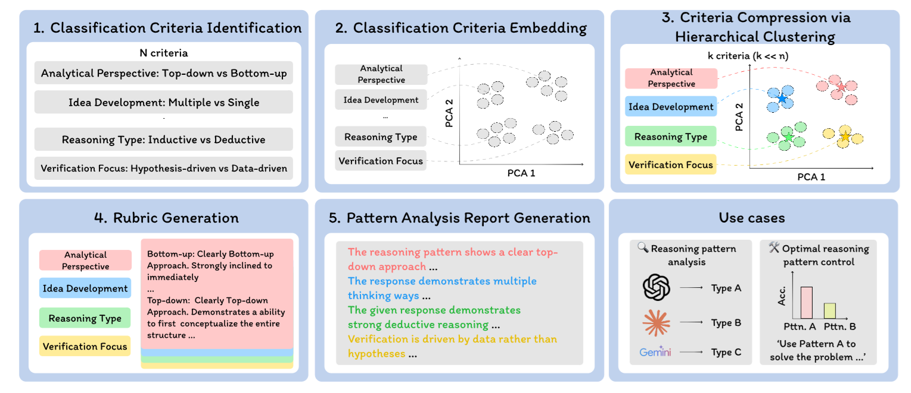 |[Paper](https://arxiv.org/abs/2505.10185)| [//]: #05/19
|[](https://github.com/microsoft/x-reasoner)<br>[X-Reasoner: Towards Generalizable Reasoning Across Modalities and Domains](https://arxiv.org/abs/2505.03981) <br> Qianchu Liu, Sheng Zhang, Guanghui Qin, Timothy Ossowski, Yu Gu, Ying Jin, Sid Kiblawi, Sam Preston, Mu Wei, Paul Vozila, Tristan Naumann, Hoifung Poon | |[Github](https://github.com/microsoft/x-reasoner) <br> [Paper](https://arxiv.org/abs/2505.03981)| [//]: #05/18
|[Skywork-VL Reward: An Effective Reward Model for Multimodal Understanding and Reasoning](https://arxiv.org/abs/2505.07263) <br> Xiaokun Wang, Chris, Jiangbo Pei, Wei Shen, Yi Peng, Yunzhuo Hao, Weijie Qiu, Ai Jian, Tianyidan Xie, Xuchen Song, Yang Liu, Yahui Zhou | |[Paper](https://arxiv.org/abs/2505.07263)| [//]: #05/18
| []()<br>[MathCoder-VL: Bridging Vision and Code for Enhanced Multimodal Mathematical Reasoning](https://arxiv.org/abs/2505.10557) <br> Ke Wang, Junting Pan, Linda Wei, Aojun Zhou, Weikang Shi, Zimu Lu, Han Xiao, Yunqiao Yang, Houxing Ren, Mingjie Zhan, Hongsheng Li | |[Paper](https://arxiv.org/abs/2505.10557)| [//]: #05/18
|[](https://github.com/ChengJade/VISTAR)<br>[Visually Interpretable Subtask Reasoning for Visual Question Answering](https://arxiv.org/abs/2505.08084) <br> Yu Cheng, Arushi Goel, Hakan Bilen | |[Github](https://github.com/ChengJade/VISTAR) <br> [Paper](https://arxiv.org/abs/2505.08084)| [//]: #05/18
|[](https://github.com/shiqichen17/VLM_Merging) []()<br>[Bring Reason to Vision: Understanding Perception and Reasoning through Model Merging](https://arxiv.org/abs/2505.05464) <br> Shiqi Chen, Jinghan Zhang, Tongyao Zhu, Wei Liu, Siyang Gao, Miao Xiong, Manling Li, Junxian He | |[Github](https://github.com/shiqichen17/VLM_Merging) <br> [Paper](https://arxiv.org/abs/2505.05464)| [//]: #05/18
|[](https://github.com/SkyworkAI/Skywork-R1V)<br>[Skywork R1V2: Multimodal Hybrid Reinforcement Learning for Reasoning](https://arxiv.org/abs/2504.16656) <br> Chris, Yichen Wei, Yi Peng, Xiaokun Wang, Weijie Qiu, Wei Shen, Tianyidan Xie, Jiangbo Pei, Jianhao Zhang, Yunzhuo Hao, Xuchen Song, Yang Liu, Yahui Zhou | |[Github](https://github.com/SkyworkAI/Skywork-R1V) <br> [Paper](https://arxiv.org/abs/2504.16656)| [//]: #04/29


###### Technical Report

* [Seed1.5-VL Technical Report](https://arxiv.org/abs/2505.07062). seed team. [[Paper]](https://arxiv.org/abs/2505.07062)

### Evaluation and Benchmarks


#### Metric
| Title & Authors | Introduction | Links |
|:--|  :----: | :---:|
|[Do NOT Think That Much for 2+3=? On the Overthinking of o1-Like LLMs](https://arxiv.org/abs/2412.21187) <br> Xingyu Chen, Jiahao Xu, Tian Liang, Zhiwei He, Jianhui Pang, Dian Yu, Linfeng Song, Qiuzhi Liu, Mengfei Zhou, Zhuosheng Zhang, Rui Wang, Zhaopeng Tu, Haitao Mi, Dong Yu | |[Paper](https://arxiv.org/abs/2412.21187)|[//]: #03/16
|[](https://github.com/horseee/CoT-Valve)<br>[CoT-Valve: Length-Compressible Chain-of-Thought Tuning](https://arxiv.org/abs/2502.09601) <br> Xinyin Ma, Guangnian Wan, Runpeng Yu, Gongfan Fang, Xinchao Wang | |[Github](https://github.com/horseee/CoT-Valve) <br> [Paper](https://arxiv.org/abs/2502.09601)|[//]: #03/16
|[](https://github.com/breckbaldwin/llm-stability)<br>[Non-Determinism of "Deterministic" LLM Settings](https://arxiv.org/abs/2408.04667) <br> Berk Atil, Sarp Aykent, Alexa Chittams, Lisheng Fu, Rebecca J. Passonneau, Evan Radcliffe, Guru Rajan Rajagopal, Adam Sloan, Tomasz Tudrej, Ferhan Ture, Zhe Wu, Lixinyu Xu, Breck Baldwin | |[Github](https://github.com/breckbaldwin/llm-stability) <br> [Paper](https://arxiv.org/abs/2408.04667)| [//]: #04/08
|[The Danger of Overthinking: Examining the Reasoning-Action Dilemma in Agentic Tasks](https://arxiv.org/abs/2502.08235) <br> Alejandro Cuadron, Dacheng Li, Wenjie Ma, Xingyao Wang, Yichuan Wang, Siyuan Zhuang, Shu Liu, Luis Gaspar Schroeder, Tian Xia, Huanzhi Mao, Nicholas Thumiger, Aditya Desai, Ion Stoica, Ana Klimovic, Graham Neubig, Joseph E. Gonzalez | |[Paper](https://arxiv.org/abs/2502.08235)| [//]: #04/08
|[Evaluating Large Language Models Trained on Code](https://arxiv.org/abs/2107.03374) <br> Mark Chen, Jerry Tworek, et al. |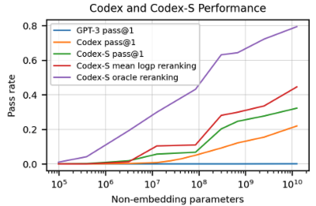 |[Paper](https://arxiv.org/abs/2107.03374)| [//]: #04/08
|[τ-bench: A Benchmark for Tool-Agent-User Interaction in Real-World Domains](https://arxiv.org/abs/2406.12045) <br> Shunyu Yao, Noah Shinn, Pedram Razavi, Karthik Narasimhan |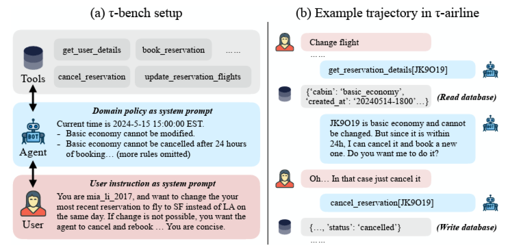 |[Paper](https://arxiv.org/abs/2406.12045)| [//]: #04/08
|[](https://github.com/open-compass/GPassK)<br>[Are Your LLMs Capable of Stable Reasoning?](https://arxiv.org/abs/2412.13147) <br> Junnan Liu, Hongwei Liu, Linchen Xiao, Ziyi Wang, Kuikun Liu, Songyang Gao, Wenwei Zhang, Songyang Zhang, Kai Chen | |[Github](https://github.com/open-compass/GPassK) <br> [Paper](https://arxiv.org/abs/2412.13147)| [//]: #04/08


#### Benchmarks and Datasets
| Title & Authors | Introduction | Links |
|:--|  :----: | :---:|
|[StoryReasoning Dataset: Using Chain-of-Thought for Scene Understanding and Grounded Story Generation](https://arxiv.org/abs/2505.10292) <br> Daniel A. P. Oliveira, David Martins de Matos |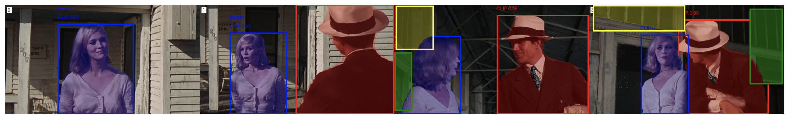 |[Paper](https://arxiv.org/abs/2505.10292)| [//]: #05/17
|[](https://github.com/alibaba-damo-academy/VCBench)<br>[Benchmarking Multimodal Mathematical Reasoning with Explicit Visual Dependency](https://arxiv.org/abs/2504.18589) <br> Zhikai Wang, Jiashuo Sun, Wenqi Zhang, Zhiqiang Hu, Xin Li, Fan Wang, Deli Zhao | |[Github](https://github.com/alibaba-damo-academy/VCBench) <br> [Paper](https://arxiv.org/abs/2504.18589)| [//]: #04/29
|[](https://github.com/Goodman-liyu/CipherBank)<br>[CipherBank: Exploring the Boundary of LLM Reasoning Capabilities through Cryptography Challenges](https://arxiv.org/abs/2504.19093) <br> Yu Li, Qizhi Pei, Mengyuan Sun, Honglin Lin, Chenlin Ming, Xin Gao, Jiang Wu, Conghui He, Lijun Wu | |[Github](https://github.com/Goodman-liyu/CipherBank) <br> [Paper](https://arxiv.org/abs/2504.19093)| [//]: #04/29
|[](https://github.com/VisuLogic-Benchmark/VisuLogic-Eval)<br>[VisuLogic: A Benchmark for Evaluating Visual Reasoning in Multi-modal Large Language Models](https://arxiv.org/abs/2504.15279) <br> Weiye Xu, Jiahao Wang, Weiyun Wang, Zhe Chen, Wengang Zhou, Aijun Yang, Lewei Lu, Houqiang Li, Xiaohua Wang, Xizhou Zhu, Wenhai Wang, Jifeng Dai, Jinguo Zhu | |[Github](https://github.com/VisuLogic-Benchmark/VisuLogic-Eval) <br> [Paper](https://arxiv.org/abs/2504.15279)| [//]: #04/25
|[LongPerceptualThoughts: Distilling System-2 Reasoning for System-1 Perception](https://arxiv.org/abs/2504.15362) <br> Yuan-Hong Liao, Sven Elflein, Liu He, Laura Leal-Taixé, Yejin Choi, Sanja Fidler, David Acuna | |[Paper](https://arxiv.org/abs/2504.15362)| [//]: #04/23
|[THOUGHTTERMINATOR: Benchmarking, Calibrating, and Mitigating Overthinking in Reasoning Models](https://arxiv.org/abs/2504.13367) <br> Xiao Pu, Michael Saxon, Wenyue Hua, William Yang Wang | |[Paper](https://arxiv.org/abs/2504.13367)| [//]: #04/21
|[Do NOT Think That Much for 2+3=? On the Overthinking of o1-Like LLMs](https://arxiv.org/abs/2412.21187) <br> Xingyu Chen, Jiahao Xu, Tian Liang, Zhiwei He, Jianhui Pang, Dian Yu, Linfeng Song, Qiuzhi Liu, Mengfei Zhou, Zhuosheng Zhang, Rui Wang, Zhaopeng Tu, Haitao Mi, Dong Yu | |[Paper](https://arxiv.org/abs/2412.21187)|[//]: #03/16
|[The Danger of Overthinking: Examining the Reasoning-Action Dilemma in Agentic Tasks](https://arxiv.org/abs/2502.08235) <br> Alejandro Cuadron, Dacheng Li, Wenjie Ma, Xingyao Wang, Yichuan Wang, Siyuan Zhuang, Shu Liu, Luis Gaspar Schroeder, Tian Xia, Huanzhi Mao, Nicholas Thumiger, Aditya Desai, Ion Stoica, Ana Klimovic, Graham Neubig, Joseph E. Gonzalez | |[Paper](https://arxiv.org/abs/2502.08235)| [//]: #04/08
|[](https://github.com/divelab/sys2bench)<br>[Inference-Time Computations for LLM Reasoning and Planning: A Benchmark and Insights](https://arxiv.org/abs/2502.12521) <br> Shubham Parashar, Blake Olson, Sambhav Khurana, Eric Li, Hongyi Ling, James Caverlee, Shuiwang Ji | |[Github](https://github.com/divelab/sys2bench) <br> [Paper](https://arxiv.org/abs/2502.12521)| [//]: #04/08
|[](https://github.com/usail-hkust/benchmark_inference_time_computation_LLM)<br>[Bag of Tricks for Inference-time Computation of LLM Reasoning](https://arxiv.org/abs/2502.07191) <br> Fan Liu, Wenshuo Chao, Naiqiang Tan, Hao Liu | |[Github](https://github.com/usail-hkust/benchmark_inference_time_computation_LLM) <br> [Paper](https://arxiv.org/abs/2502.07191)| [//]: #04/08
|[](https://github.com/RyanLiu112/compute-optimal-tts)<br>[Can 1B LLM Surpass 405B LLM? Rethinking Compute-Optimal Test-Time Scaling](https://arxiv.org/abs/2502.06703) <br> Runze Liu, Junqi Gao, Jian Zhao, Kaiyan Zhang, Xiu Li, Biqing Qi, Wanli Ouyang, Bowen Zhou | |[Github](https://github.com/RyanLiu112/compute-optimal-tts) <br> [Paper](https://arxiv.org/abs/2502.06703)| [//]: #04/08
|[DNA Bench: When Silence is Smarter -- Benchmarking Over-Reasoning in Reasoning LLMs](https://arxiv.org/abs/2503.15793) <br> Masoud Hashemi, Oluwanifemi Bamgbose, Sathwik Tejaswi Madhusudhan, Jishnu Sethumadhavan Nair, Aman Tiwari, Vikas Yadav | |[Paper](https://arxiv.org/abs/2503.15793)| [//]: #04/08
|[S1-Bench: A Simple Benchmark for Evaluating System 1 Thinking Capability of Large Reasoning Models](https://arxiv.org/abs/2504.10368) <br> Wenyuan Zhang, Shuaiyi Nie, Xinghua Zhang, Zefeng Zhang, Tingwen Liu |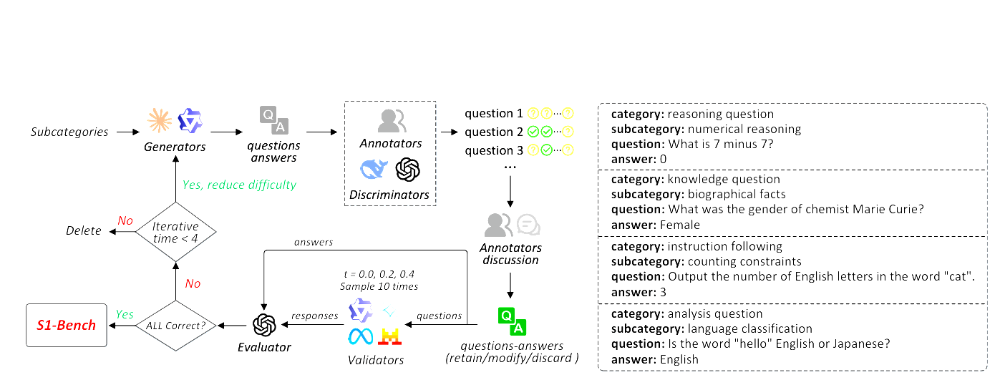 |[Paper](https://arxiv.org/abs/2504.10368)| [//]: #04/14
|[](https://github.com/zhishuifeiqian/VCR-Bench)<br>[VCR-Bench: A Comprehensive Evaluation Framework for Video Chain-of-Thought Reasoning](https://arxiv.org/abs/2504.07956) <br> Yukun Qi, Yiming Zhao, Yu Zeng, Xikun Bao, Wenxuan Huang, Lin Chen, Zehui Chen, Jie Zhao, Zhongang Qi, Feng Zhao |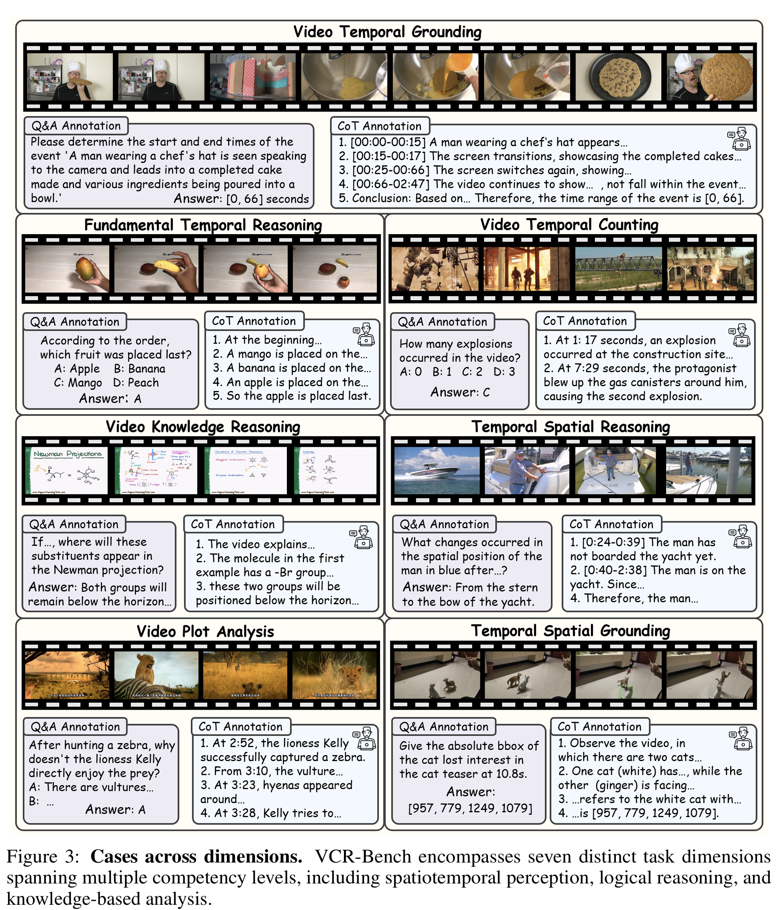 |[Github](https://github.com/zhishuifeiqian/VCR-Bench) <br> [Paper](https://arxiv.org/abs/2504.07956)| [//]: #04/16


### Background Papers
| Title & Authors | Introduction | Links |
|:--|  :----: | :---:|
|[Reinforcing the Diffusion Chain of Lateral Thought with Diffusion Language Models](https://arxiv.org/abs/2505.10446) <br> Zemin Huang, Zhiyang Chen, Zijun Wang, Tiancheng Li, Guo-Jun Qi | |[Paper](https://arxiv.org/abs/2505.10446)| [//]: #05/18
|[J1: Incentivizing Thinking in LLM-as-a-Judge via Reinforcement Learning](https://arxiv.org/abs/2505.10320) <br> Chenxi Whitehouse, Tianlu Wang, Ping Yu, Xian Li, Jason Weston, Ilia Kulikov, Swarnadeep Saha | |[Paper](https://arxiv.org/abs/2505.10320)| [//]: #05/18
|[INTELLECT-2: A Reasoning Model Trained Through Globally Decentralized Reinforcement Learning](https://arxiv.org/abs/2505.07291) <br> Prime Intellect Team, Sami Jaghouar, Justus Mattern, Jack Min Ong, Jannik Straube, Manveer Basra, Aaron Pazdera, Kushal Thaman, Matthew Di Ferrante, Felix Gabriel, Fares Obeid, Kemal Erdem, Michael Keiblinger, Johannes Hagemann | |[Paper](https://arxiv.org/abs/2505.07291)| [//]: #05/18
|[AM-Thinking-v1: Advancing the Frontier of Reasoning at 32B Scale](https://arxiv.org/abs/2505.08311) <br> Yunjie Ji, Xiaoyu Tian, Sitong Zhao, Haotian Wang, Shuaiting Chen, Yiping Peng, Han Zhao, Xiangang Li | |[Paper](https://arxiv.org/abs/2505.08311)| [//]: #05/18
|[](https://github.com/solitaryzero/CoTs_are_Variables)<br>[Chain-of-Thought Tokens are Computer Program Variables](https://arxiv.org/abs/2505.04955) <br> Fangwei Zhu, Peiyi Wang, Zhifang Sui | |[Github](https://github.com/solitaryzero/CoTs_are_Variables) <br> [Paper](https://arxiv.org/abs/2505.04955)| [//]: #05/17
|[](https://github.com/xiaomimimo/MiMo)<br>[MiMo: Unlocking the Reasoning Potential of Language Model -- From Pretraining to Posttraining](https://arxiv.org/abs/2505.07608) <br> Xiaomi LLM-Core Team | |[Github](https://github.com/xiaomimimo/MiMo) <br> [Paper](https://arxiv.org/abs/2505.07608)| [//]: #05/17
|[Thoughts without Thinking: Reconsidering the Explanatory Value of Chain-of-Thought Reasoning in LLMs through Agentic Pipelines](https://arxiv.org/abs/2505.00875) <br> Ramesh Manuvinakurike, Emanuel Moss, Elizabeth Anne Watkins, Saurav Sahay, Giuseppe Raffa, Lama Nachman | |[Paper](https://arxiv.org/abs/2505.00875)| [//]: #05/05
|[Between Underthinking and Overthinking: An Empirical Study of Reasoning Length and correctness in LLMs](https://arxiv.org/abs/2505.00127) <br> Jinyan Su, Jennifer Healey, Preslav Nakov, Claire Cardie | |[Paper](https://arxiv.org/abs/2505.00127)|[//]: #05/02
|[](https://github.com/RUC-NLPIR/WebThinker)<br>[WebThinker: Empowering Large Reasoning Models with Deep Research Capability](https://arxiv.org/abs/2504.21776) <br> Xiaoxi Li, Jiajie Jin, Guanting Dong, Hongjin Qian, Yutao Zhu, Yongkang Wu, Ji-Rong Wen, Zhicheng Dou |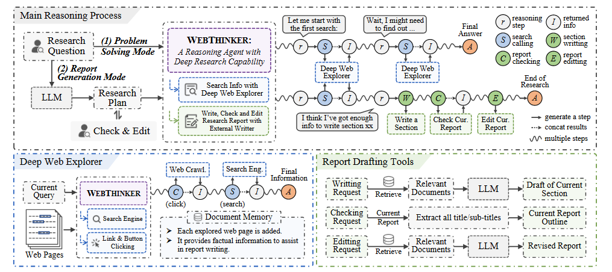 |[Github](https://github.com/RUC-NLPIR/WebThinker) <br> [Paper](https://arxiv.org/abs/2504.21776)|[//]: #05/02
|[](https://github.com/hammoudhasan/SubthoughtReasoner)<br>[Beyond the Last Answer: Your Reasoning Trace Uncovers More than You Think](https://arxiv.org/abs/2504.20708) <br> Hasan Abed Al Kader Hammoud, Hani Itani, Bernard Ghanem | |[Github](https://github.com/hammoudhasan/SubthoughtReasoner) <br> [Paper](https://arxiv.org/abs/2504.20708)|[//]: #05/02
|[](https://github.com/ypwang61/One-Shot-RLVR)<br>[Reinforcement Learning for Reasoning in Large Language Models with One Training Example](https://arxiv.org/abs/2504.20571) <br> Yiping Wang, Qing Yang, Zhiyuan Zeng, Liliang Ren, Lucas Liu, Baolin Peng, Hao Cheng, Xuehai He, Kuan Wang, Jianfeng Gao, Weizhu Chen, Shuohang Wang, Simon Shaolei Du, Yelong Shen | |[Github](https://github.com/ypwang61/One-Shot-RLVR) <br> [Paper](https://arxiv.org/abs/2504.20571)|[//]: #04/30
|[](https://github.com/SkyworkAI/Skywork-R1V)<br>[Skywork R1V2: Multimodal Hybrid Reinforcement Learning for Reasoning](https://arxiv.org/abs/2504.16656) <br> Chris, Yichen Wei, Yi Peng, Xiaokun Wang, Weijie Qiu, Wei Shen, Tianyidan Xie, Jiangbo Pei, Jianhao Zhang, Yunzhuo Hao, Xuchen Song, Yang Liu, Yahui Zhou | |[Github](https://github.com/SkyworkAI/Skywork-R1V) <br> [Paper](https://arxiv.org/abs/2504.16656)| [//]: #04/29
|[](https://github.com/LeapLabTHU/limit-of-RLVR)<br>[Does Reinforcement Learning Really Incentivize Reasoning Capacity in LLMs Beyond the Base Model?](https://arxiv.org/abs/2504.13837) <br> Yang Yue, Zhiqi Chen, Rui Lu, Andrew Zhao, Zhaokai Wang, Yang Yue, Shiji Song, Gao Huang | |[Github](https://github.com/LeapLabTHU/limit-of-RLVR) <br> [Paper](https://arxiv.org/abs/2504.13837)| [//]: #04/22
| []()<br>[Chain-of-Thought Prompting Elicits Reasoning in Large Language Models](https://arxiv.org/abs/2201.11903) <br> Jason Wei, Xuezhi Wang, Dale Schuurmans, Maarten Bosma, Brian Ichter, Fei Xia, Ed Chi, Quoc Le, Denny Zhou |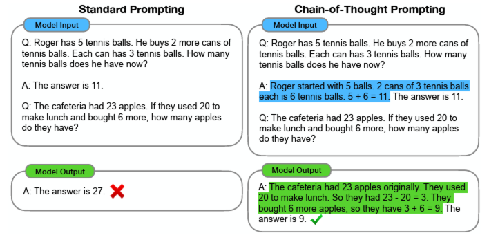 |[Paper](https://arxiv.org/abs/2201.11903)| [//]: #04/08
|[](https://github.com/princeton-nlp/tree-of-thought-llm) []()<br>[Tree of Thoughts: Deliberate Problem Solving with Large Language Models](https://arxiv.org/abs/2305.10601) <br> Shunyu Yao, Dian Yu, Jeffrey Zhao, Izhak Shafran, Thomas L. Griffiths, Yuan Cao, Karthik Narasimhan | |[Github](https://github.com/princeton-nlp/tree-of-thought-llm) <br> [Paper](https://arxiv.org/abs/2305.10601)| [//]: #04/08
|[](https://github.com/spcl/graph-of-thoughts) []()<br>[Graph of Thoughts: Solving Elaborate Problems with Large Language Models](https://arxiv.org/abs/2308.09687) <br> Maciej Besta, Nils Blach, Ales Kubicek, Robert Gerstenberger, Michal Podstawski, Lukas Gianinazzi, Joanna Gajda, Tomasz Lehmann, Hubert Niewiadomski, Piotr Nyczyk, Torsten Hoefler |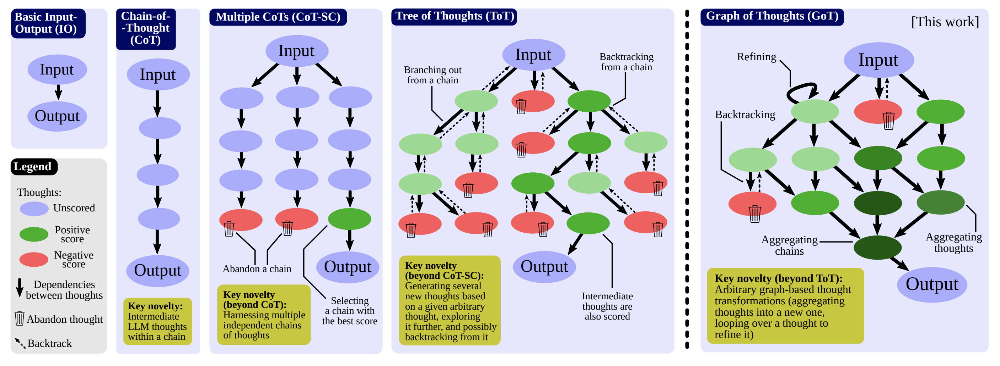 |[Github](https://github.com/spcl/graph-of-thoughts) <br> [Paper](https://arxiv.org/abs/2308.09687)| [//]: #04/08
| []()<br>[Self-Consistency Improves Chain of Thought Reasoning in Language Models](https://arxiv.org/abs/2203.11171) <br> Xuezhi Wang, Jason Wei, Dale Schuurmans, Quoc Le, Ed Chi, Sharan Narang, Aakanksha Chowdhery, Denny Zhou |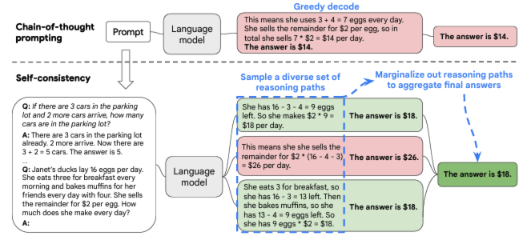 |[Paper](https://arxiv.org/abs/2203.11171)| [//]: #04/08
|[](https://github.com/TIGER-AI-Lab/Program-of-Thoughts) []()<br>[Program of Thoughts Prompting: Disentangling Computation from Reasoning for Numerical Reasoning Tasks](https://arxiv.org/abs/2211.12588) <br> Wenhu Chen, Xueguang Ma, Xinyi Wang, William W. Cohen |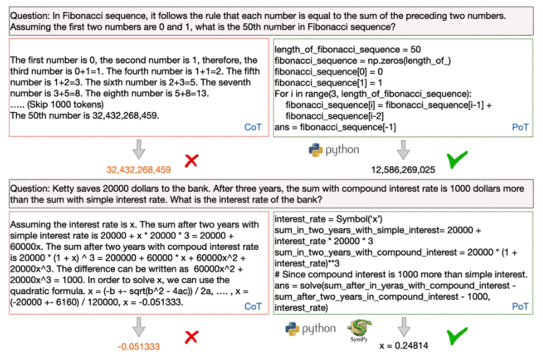 |[Github](https://github.com/TIGER-AI-Lab/Program-of-Thoughts) <br> [Paper](https://arxiv.org/abs/2211.12588)| [//]: #04/08
|[](https://github.com/hanxuhu/chain-of-symbol-planning) []()<br>[Chain-of-Symbol Prompting Elicits Planning in Large Langauge Models](https://arxiv.org/abs/2305.10276) <br> Hanxu Hu, Hongyuan Lu, Huajian Zhang, Yun-Ze Song, Wai Lam, Yue Zhang | |[Github](https://github.com/hanxuhu/chain-of-symbol-planning) <br> [Paper](https://arxiv.org/abs/2305.10276)| [//]: #04/08

###### Survey
| Title & Authors | Introduction | Links |
|:--|  :----: | :---:|
|[Thinking Machines: A Survey of LLM based Reasoning Strategies](https://arxiv.org/abs/2503.10814) <br> Dibyanayan Bandyopadhyay, Soham Bhattacharjee, Asif Ekbal | |[Paper](https://arxiv.org/abs/2503.10814)| [//]: #04/08
|[](https://github.com/zzli2022/Awesome-System2-Reasoning-LLM)<br>[From System 1 to System 2: A Survey of Reasoning Large Language Models](https://arxiv.org/abs/2502.17419) <br> Zhong-Zhi Li, Duzhen Zhang, Ming-Liang Zhang, Jiaxin Zhang, Zengyan Liu, Yuxuan Yao, Haotian Xu, Junhao Zheng, Pei-Jie Wang, Xiuyi Chen, Yingying Zhang, Fei Yin, Jiahua Dong, Zhijiang Guo, Le Song, Cheng-Lin Liu | |[Github](https://github.com/zzli2022/Awesome-System2-Reasoning-LLM) <br> [Paper](https://arxiv.org/abs/2502.17419)| [//]: #04/08


### Competition

*  []() [](https://github.com/NVIDIA/NeMo-Skills) [AIMO-2 Winning Solution: Building State-of-the-Art Mathematical Reasoning Models with OpenMathReasoning dataset](https://arxiv.org/abs/2504.16891). Ivan Moshkov, Darragh Hanley, Ivan Sorokin, Shubham Toshniwal, Christof Henkel, Benedikt Schifferer, Wei Du, Igor Gitman. [[Paper]](https://arxiv.org/abs/2504.16891)[[Github]](https://github.com/NVIDIA/NeMo-Skills)


## Acknowledgement

This repository is inspired by [Awesome-Efficient-LLM](https://github.com/horseee/Awesome-Efficient-LLM/)


## Citation

```bibtex
@article{,
    title={Efficient Reasoning Models: A Survey},
    author={Feng, Sicheng and Fang, Gongfan and Ma, Xinyin and Wang, Xinchao},
    journal={arXiv preprint arXiv:2504.10903},
    year={2025},
}
```
